# MYLO
MYLO este o platformă de Machine Learning construită ca un motor inteligent de creare, analiză și optimizare a modelelor, unde arhitectura rețelelor neuronale devine complet programabilă. În loc să trateze modelele ca niște “cutii negre”, MYLO le transformă în grafuri dinamice editabile, permițând modificări structurale în timp real, validare automată și execuție sigură.

Sistemul combină un editor arhitectural avansat, analiză de date și algoritmi de optimizare de ultimă generație (neuroevoluție și Optuna Hyperparameter Optimization), oferind atât control fin pentru experți, cât și automatizare agresivă pentru rezultate rapide. Practic, MYLO nu doar antrenează modele — le înțelege, le reconstruiește și le evoluează.
[Web interface repo ](https://github.com/M-Y-L-O/WebInterface) 
[Client repo ](https://github.com/M-Y-L-O/MYLO-Desktop-Agent) 
[Client Orchestrator](https://github.com/M-Y-L-O/Orchestrator) 

# Documentație in format docs (RECOMANDAT, ACTUALIZAT)
[Documentation](https://docs.google.com/document/d/1bOaJbjaP7HBHJHmbMLrH6HiqskNWnJEbzksapTdhZ0U/edit?usp=sharing)

# Documentație MYLO

**Visual Neural Network Studio** — platformă web pentru design, editare, analiză și optimizare automată a modelelor de învățare automată.

---

## Cuprins general

### Partea I — Prezentare

1. [Rezumat Executiv](#rezumat-executiv)
2. [De ce există MYLO?](#de-ce-există-mylo)
3. [Arhitectura Ecosistemului MYLO](#arhitectura-ecosistemului-mylo)
4. [Comparație cu soluții existente](#comparație-cu-soluții-existente)
5. [Manual de Utilizare](#manual-de-utilizare)
6. [Performanță](#performanță)
7. [Testare și Validare](#testare-și-validare)

### Partea II — Web Interface (documentație tehnică)

8. [Web Interface — Introducere](#web-interface--introducere)
9. [Arhitectura Generală](#arhitectura-generală)
10. [Structura Proiectului](#structura-proiectului)
11. [Pagini și Rute](#pagini-și-rute)
12. [API Routes (Next.js)](#api-routes-nextjs)
13. [Autentificare](#autentificare)
14. [Sistem de Ferestre (Window Manager)](#sistem-de-ferestre-window-manager)
15. [Client LOCAL vs CLOUD](#client-local-vs-cloud)
16. [Tunnel și Proxy Cloud](#tunnel-și-proxy-cloud)
17. [Client HTTP către Agent](#client-http-către-agent)
18. [State Management (Zustand)](#state-management-zustand)
19. [Model Editor](#model-editor)
20. [Optimizare și Diagnostics](#optimizare-și-diagnostics)
21. [Analiză Date](#analiză-date)
22. [Asistent AI (Chat)](#asistent-ai-chat)
23. [Storage (Postgres + R2)](#storage-postgres--r2)
24. [Ciclu de Viață Sesiune Cloud](#ciclu-de-viață-sesiune-cloud)
25. [Fluxuri End-to-End](#fluxuri-end-to-end)
26. [Configurare Web Interface](#configurare-web-interface)

### Partea III — Desktop Agent API

27. [API MYLO — Introducere](#api-mylo)
28. [Arhitectura Agent](#arhitectura-generală-1)
29. [Endpoint-uri Agent](#api-endpoint-uri)
30. [Sisteme ML](#sisteme-ml)
31. [Formate de Date](#formate-de-date)

### Partea IV — Orchestrator

32. [Orchestrator — Introducere](#orchestrator-mylo)
33. [API Orchestrator](#api-endpoint-uri-1)
34. [Docker Manager și Sesiuni CLOUD](#docker-manager)

---

# Partea I — Prezentare

## Rezumat Executiv

**MYLO** (*Visual Neural Network Studio*) este o platformă web care permite utilizatorilor — de la studenți la practicieni ML — să **vizualizeze**, **editeze**, **analizeze** și **optimiza** rețele neuronale într-un mediu integrat, fără a scrie cod PyTorch manual.

Proiectul combină trei componente principale:

| Componentă | Rol |
|------------|-----|
| **Web Interface** (Next.js) | Interfața utilizatorului: autentificare, dashboard dockable, editor vizual, asistent AI |
| **Desktop Agent** (FastAPI + PyTorch) | Motorul ML: procesare date, editare descriptor, neuroevoluție, Optuna, export modele |
| **Orchestrator** (FastAPI + Docker) | Provisionare dinamică a agenților CLOUD în containere izolate |

Utilizatorul lucrează într-un **workspace** similar unui IDE: panouri detașabile pentru explorator de fișiere, editor de model, analiză CSV, optimizare, diagnostics și chat AI. Toate operațiile sunt executate de agent — local (pe mașina utilizatorului) sau în cloud (container Docker pornit la cerere).

**Inovații cheie față de un simplu vizualizator ONNX:**

- **ArchitectureDescriptor** — arhitectura modelului ca graf editabil (DAG), nu doar vizualizare statică
- **Model Editor** — adăugare/ștergere straturi, activări, skip connections, cu propagare automată a formelor
- **Neuroevoluție + Optuna** — optimizare automată a arhitecturii pe datele utilizatorului
- **Transfer de greutăți** — antrenament accelerat la mutații arhitecturale
- **Asistent AI** — editare model prin limbaj natural, cu tool-uri pe agent
- **Mod CLOUD** — agent izolat per sesiune, fără instalare locală

MYLO răspunde criteriilor InfoEducație prin: arhitectură modulară (SOA), separare frontend/backend/agent, securitate OAuth + proxy, scalabilitate LOCAL/CLOUD, originalitate tehnică și documentație completă.

---

## De ce există MYLO?

### Problema

Instrumentele existente pentru rețele neuronale acoperă câte o parte din fluxul de lucru:

- **Netron** vizualizează modele, dar nu le editează
- **TensorBoard** monitorizează antrenamentul, dar nu proiectează arhitecturi
- **Optuna Dashboard** optimizează hiperparametri, dar nu modelează grafic rețelele
- **HuggingFace** oferă modele pre-antrenate, dar nu un atelier vizual personalizat pe datele tale

Un practician care vrea să **încarce un CSV**, **exploreze datele**, **construiască sau modifice o rețea**, **o antreneze** și **o compare cu variante optimizate** trebuie să comute între mai multe unelte, adesea din linia de comandă.

### Soluția MYLO

MYLO unifică acest flux într-o singură aplicație web:

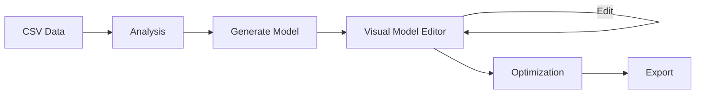

**Public țintă:**

- Studenți la cursuri de ML/AI care învață arhitecturi prin experimentare vizuală
- Dezvoltatori care prototipează rapid rețele pe date tabulare
- Utilizatori fără acces GPU local (mod CLOUD)

**Valoare adăugată:**

1. **Descriptor editabil** — modelul devine un graf pe care îl poți modifica, nu un fișier opac
2. **Validare în timp real** — formele tensorilor se propagă automat; erorile apar înainte de antrenament
3. **Optimizare arhitecturală** — algoritmi genetici și Optuna explorează variantele, nu doar hiperparametri fixi
4. **Accesibilitate** — OAuth, UI dockable, asistent AI, proiecte cloud salvate

---

## Arhitectura Ecosistemului MYLO

Diagrama de mai jos prezintă **întregul ecosistem** înainte de detaliile tehnice ale fiecărei componente.

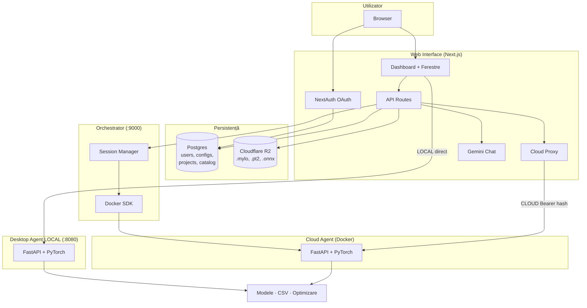

### Cum circulă datele

| Flux | Descriere |
|------|-----------|
| **Autentificare** | Browser → NextAuth → JWT → Postgres (user, cont OAuth) |
| **Config client** | Utilizator alege LOCAL sau CLOUD → salvat în `clientConfigs` |
| **Provision CLOUD** | Web API → Orchestrator → Docker run → Agent healthy → DB stochează address + apiKey |
| **Operație ML** | UI → Client/Tunnel → Agent (direct sau via proxy) → răspuns JSON/graf |
| **Salvare proiect cloud** | Agent export `.mylo` → Web server → R2 + rând `cloudProjects` |
| **Catalog** | Utilizator publică model/proiect → R2 + `catalogItems` → alții descarcă |

### Design patterns utilizate

| Pattern | Unde | De ce |
|---------|------|-------|
| **Separation of concerns** | UI / Agent / Orchestrator | UI fără PyTorch; ML fără OAuth |
| **Reverse proxy** | `/api/cloud/proxy` | Ascunde cheia API și adresa containerului |
| **Client abstraction** | `Client.ts` + `Tunnel.ts` | Același cod UI pentru LOCAL și CLOUD |
| **Orchestrator / provisioner** | Docker lifecycle | Scalare cloud fără logică ML în UI |
| **State stores** | Zustand (client, project, workspace) | UI reactiv, persistență sessionStorage |
| **Window registry** | `windowTypes.tsx` + Dockview | Panouri plug-in, layout salvat per proiect |
| **Descriptor pattern** | `ArchitectureDescriptor` | Reprezentare serializabilă, validabilă, compilabilă |
| **Strategy** | Neuroevoluție vs Optuna | Aceeași interfață optimizare, algoritmi diferiți |

---

## Comparație cu soluții existente

| Capabilitate | Netron | TensorBoard | Optuna Dashboard | HuggingFace Hub | **MYLO** |
|--------------|--------|-------------|------------------|-----------------|----------|
| Vizualizare arhitectură | v | ~ grafice antrenament | x | ~ card model | v graf interactiv |
| Editare arhitectură | x | x | x | x | v editor DAG |
| Analiză CSV / date tabulare | x | x | x | x | v statistici, corelații, grafice |
| Optimizare arhitecturală | x | x | ~ hiperparametri | x | v neuroevoluție + Optuna |
| Transfer greutăți la mutații | x | x | x | x | v WeightCompatibilityEngine |
| Proiecte salvate (model + CSV + raport) | x | x | x | ~ repo separat | v format `.mylo` |
| Mod cloud fără instalare | x | x | x | v (inferență) | v agent dedicat per sesiune |
| Asistent AI pentru editare | x | x | x | x | ✅ Gemini + tool-uri agent |
| Catalog partajat | x | x | x | v | v proiecte + .pt2 + .onnx |

**Concluzie:** MYLO nu concurează direct cu un singur produs, ci **integrează** capabilități dispersate (vizualizare Netron-like, optimizare Optuna-like, workflow proiect) într-un **studio vizual unic**, cu accent pe **editare și evoluție arhitecturală**, nu doar inferență sau monitorizare.

---

## Manual de Utilizare

Acest capitol descrie aplicația din perspectiva **utilizatorului**, pas cu pas. Presupune că ai un cont (GitHub sau Google) și, pentru mod LOCAL, Desktop Agent pornit pe `http://127.0.0.1:8080`.

---

### 1. Pagina principală (`/`)

Pagina de landing prezintă MYLO ca **Visual Neural Network Studio**: graf animat interactiv și butoane **Get started** / **Docs**, care duc la autentificare.

**Ce poți face:** înțelegi rapid scopul aplicației înainte de login.

---

### 2. Autentificare (`/auth`)

1. Deschide `/auth`
2. Alege **Login with GitHub** sau **Login with Google**
3. După OAuth, ești redirecționat automat la **`/home`**

Dacă ești deja autentificat, pagina te trimite direct la Home.

---

### 3. Hub Home (`/home`)

Home este centrul de control înainte de a deschide un proiect. Are **trei tab-uri** (meniu lateral):

| Tab | Nume | Funcție |
|-----|------|---------|
| 0 | **Projects** | Proiecte curente și proiecte salvate în cloud |
| 1 | **Clients** | Conexiuni LOCAL / CLOUD către agent |
| 2 | **Catalog** | Modele și proiecte partajate de comunitate |

**Indicator conexiune:** în partea de sus vezi statusul clientului activ — *Connected*, *Connecting* sau *Offline*. Trebuie să fii **Connected** înainte de a lucra la un proiect.

**Profil:** dropdown cu numele utilizatorului și opțiune de **Sign out**.

---

### 4. Configurare client (`/home` → tab Clients)

Agentul MYLO poate rula **local** (pe calculatorul tău) sau **în cloud** (container Docker).

#### 4.1 Client LOCAL

1. Tab **Clients** → **New config**
2. Tip: **LOCAL**
3. Nume: ex. „My laptop”
4. Adresă: `http://127.0.0.1:8080` (implicit)
5. API Key: cheia configurată la agent (ex. `1234`)
6. Salvează → selectează config-ul din listă

La prima conectare, aplicația poate inițializa sesiunea agentului (`/initialize`). Status devine **Connected**.

> **Cerință:** Desktop Agent trebuie pornit local (`python App.py` în `MYLO-Desktop-Agent`).

#### 4.2 Client CLOUD

1. Tab **Clients** → **New config**
2. Tip: **CLOUD**
3. Nume: ex. „Cloud session”
4. Salvează → aplicația pornește automat un container via Orchestrator

Nu introduci manual adresă sau cheie — Web Interface le gestionează securizat. Poți **Restart** sesiunea cloud dacă agentul devine inaccesibil.

#### 4.3 Ștergere config

Ștergerea unui config CLOUD oprește și containerul asociat.

---

### 5. Proiecte (`/home` → tab Projects)

#### 5.1 Proiect nou

1. Asigură-te că ești **Connected**
2. Apasă **New Project**
3. Introdu numele proiectului
4. Confirmă → ești dus la **Dashboard** cu proiect gol

#### 5.2 Continuare proiect activ

Dacă agentul are deja un proiect încărcat, îl vezi listat. Apasă **Open** pentru a merge la Dashboard.

#### 5.3 Deschidere fișier `.mylo` (local)

**Upload Project** — selectezi un fișier `.mylo` de pe disk; agentul îl încarcă și deschide dashboard-ul.

#### 5.4 Proiecte cloud

Lista **Cloud Projects** arată proiectele salvate în contul tău (R2). **Open** descarcă proiectul, îl încarcă în agent și deschide dashboard-ul.

**Save to Cloud** (din Dashboard) salvează proiectul curent; poți suprascrie dacă există deja același nume.

---

### 6. Catalog (`/home` → tab Catalog)

Catalogul conține resurse **partajate**:

- Proiecte complete (`.mylo`)
- Modele standalone (`.pt2`, `.onnx`)

**Open** descarcă resursa, o încarcă în agent și deschide dashboard-ul (editor sau visualiser, după tip).

---

### 7. Dashboard (`/dashboard`)

Dashboard-ul este **IDE-ul principal**: bară de meniu sus + zonă de panouri dockable (poți muta, redimensiona, detașa ferestre).

#### 7.1 Meniu Project

| Acțiune | Efect |
|---------|-------|
| **Save Project** | Export `.mylo` pe disk (download) |
| **Save to Cloud** | Salvează proiectul în cloud (contul tău) |
| **Open Project** | Încarcă `.mylo` din fișier |
| **Load Model** | Upload `.pt2` sau `.onnx` |
| **Load CSV** | Upload fișier CSV pentru analiză și antrenament |

#### 7.2 Meniu View

Deschide panouri:

| Panou | Rol |
|-------|-----|
| **Project Manager** (File Explorer) | Sloturi model, upload, vizualizare, editor |
| **Dataset Info** | Statistici și grafice CSV |
| **Data viewer** | Tabel cu datele |
| **Properties** | Detalii nod selectat din graf |
| **AI Assistant** | Chat cu asistentul MYLO |

Alte panouri (Model Editor, Optimization, Diagnostics, Visualiser) se deschid din **Project Manager** sau programatic.

**Logo MYLO** (stânga sus) te întoarce la `/home`.

---

### 8. Project Manager (File Explorer)

Gestionează **sloturile** proiectului:

| Secțiune | Sloturi tipice |
|----------|----------------|
| **Uploaded** | Model încărcat (.pt2 / .onnx) |
| **Optimized** | Modele generate după optimizare |

**Acțiuni per slot:**

- **Upload** — încarcă fișier în slot
- **Visualize** — deschide panoul **Visualiser** cu graful modelului
- **Edit** — deschide **Model Editor** (doar pentru descriptor editabil, ex. .pt2)
- **Optimize** — deschide panoul **Optimization** pentru acel model
- **Template** — pornește de la un șablon predefinit (rețea simplă)

---

### 9. Încărcare CSV și analiză date

1. **Project → Load CSV** sau upload din File Explorer
2. Deschide **Dataset Info** (View → Dataset Info)

**Dataset Info** afișează:

- Statistici descriptive pe coloane
- Matrice de corelație
- Distribuții
- Indicatori de calitate a datelor

**Data viewer** arată tabelul brut. Aceste date alimentează ulterior **Optimization** (alegerea feature-urilor și a țintei).

---

### 10. Visualiser (vizualizare model)

Panou **read-only** cu graful rețelei (noduri = straturi, muchii = flux date).

- Click pe nod → panoul **Properties** afișează parametrii (tip, shape, weights summary)
- Nu editezi aici; pentru editare folosești **Model Editor**

---

### 11. Model Editor (editare arhitectură)

Editorul grafic permite modificarea arhitecturii modelului.

**Operațiuni uzuale:**

| Acțiune | Cum |
|---------|-----|
| Adăugare strat | Meniu contextual pe nod → Insert (ex. ReLU după Linear) |
| Ștergere nod | Selectează nod → Delete |
| Editare parametri | Panoul lateral (out_features, kernel_size, etc.) |
| Conectare | Trage muchie între porturi compatibile |
| Undo / Redo | Toolbar sau scurtături |
| Salvare | Save — validează strict și persistă pe agent |

**Validare:** muchiile incompatibile sunt respinse (`checkEdge`). Formele se actualizează automat după editare.

**Moduri vizualizare:** summary, detailed, hybrid (expandare subgraf ONNX).

---

### 12. Optimizare model

1. Deschide **Optimization** din File Explorer (pe un slot cu model)
2. **Setup:**
   - Coloane de intrare (`inputFeatures`)
   - Coloană țintă (`targetFeature`)
   - Tip problemă: regression / classification
   - Epoci, generații
   - Strategie: **neuroevolution** sau **optuna**
   - Encoding (none / label / onehot)
3. Apasă **Start**

**În timpul rulării:**

- Bară de progres și mesaje status (SSE live)
- Faze: procesare date → optimizare → salvare

**După finalizare (Results):**

- Rezumat: loss, acuratețe, număr parametri, verdict (improved/regressed)
- Diferențe arhitectură față de modelul inițial
- Istoric antrenament (sparkline loss)
- Linie de moștenire mutații (neuroevoluție)
- Descărcare model optimizat (.pt2 / .onnx)

> **Cerință:** CSV încărcat și coloane selectate corect.

---

### 13. Diagnostics

Panoul **Diagnostics** analizează modelul fără optimizare completă:

- Forward pass reușit/eșuat
- Shape-uri intrare/ieșire
- Număr parametri, mărime fișier
- Avertismente (straturi neutilizate, dtype, etc.)

Util pentru verificare rapidă înainte de optimizare.

---

### 14. Asistent AI (Chat)

Panoul **AI Assistant** oferă un chat cu model Gemini, conectat la proiectul curent.

**Exemple de cereri:**

- „Descrie arhitectura modelului curent”
- „Adaugă un strat ReLU după primul Linear”
- „Care coloane din CSV sunt cel mai corelate cu target-ul?”
- „Deschide panoul Optimization”

Asistentul folosește **tool-uri** care citesc descriptorul, catalogul editorului și starea proiectului, apoi aplică editări via agent. După editări AI, verifică în **Model Editor** rezultatul și salvează dacă e corect.

---

### 15. Salvare și export

| Acțiune | Rezultat |
|---------|----------|
| **Save Project** | Fișier `.mylo` (zip: model, CSV, descriptor, rapoarte) |
| **Save to Cloud** | Același conținut, stocat în contul tău (R2) |
| **Download optimized** | Din panoul Optimization / File Explorer — model optimizat |

Format `.mylo` poate fi redeschis pe orice client MYLO (LOCAL sau CLOUD) conectat.

---

### 16. Scenarii tipice de lucru

#### Scenariul A — Proiect local de la zero

1. Pornește Desktop Agent local
2. Login → Home → Clients → creează LOCAL → Connected
3. Projects → New Project
4. Load CSV → Load Model (sau Template)
5. Dataset Info → verifică date
6. Model Editor → ajustează arhitectura
7. Optimization → rulează neuroevoluție
8. Save Project

#### Scenariul B — Lucru în cloud

1. Login → Clients → CLOUD → Connected (container pornit automat)
2. New Project sau Open Cloud Project
3. Lucrezi identic în Dashboard
4. Save to Cloud la final
5. Sign out — containerul poate fi oprit din Clients (ștergere/restart)

#### Scenariul C — Model din Catalog

1. Connected → Catalog → Open pe un `.pt2`
2. Dashboard se deschide cu Model Editor
3. Editare → Optimization pe CSV-ul tău încărcat

---

## Performanță

MYLO este proiectat pentru **responsivitate UI** și **eficiență la explorarea arhitecturilor**, nu pentru antrenament distribuit la scară datacenter. Deciziile de performanță sunt documentate explicit.

### 1. Separarea UI de compute ML

| Decizie | Beneficiu |
|---------|-----------|
| Agent separat (LOCAL/CLOUD) | UI-ul rămâne ușor; GPU/CPU consumate doar la agent |
| Web Interface fără PyTorch | Build Next.js rapid; fără dependențe ML grele în browser |

### 2. Proxy cloud

| Decizie | Motiv |
|---------|-------|
| `/api/cloud/proxy` | Securitate (chei ascunse), nu cache agresiv |
| Streaming body | Fișiere mari (modele, `.mylo`) fără buffering complet în memoria serverului Next.js |
| `Authorization: Bearer sha256` | Validare rapidă la agent, fără round-trip suplimentar |

### 3. State management — Zustand

| Decizie | Motiv |
|---------|-------|
| Zustand vs Redux | Store minimal, re-render selectiv, bundle mic |
| Persistență parțială `sessionStorage` | Rehydratare rapidă la refresh dashboard; `Client` reconstruit, nu serializat |
| `descriptorDraft` ne-persistat | Draft editor + AI fără scrieri disk inutile |

### 4. Feedback optimizare — Server-Sent Events (SSE)

| Decizie | Motiv |
|---------|-------|
| `GET /optimizationStatus` (SSE) | Progres live fără polling HTTP repetat |
| `EventSource` + `?configId=` pentru CLOUD | Compatibil cu limitarea headerelor browser la SSE |

### 5. Optimizare arhitecturală — eșalonare resurse

**Neuroevoluție — TieredEvaluator:**

| Tier | Epoci | Rol |
|------|-------|-----|
| 1 | 3 | Filtrare rapidă candidați slabi |
| 2 | 8 | Antrenament extins pe promițători |
| Final | 15 | Antrenament complet pe câștigători |

**Optuna — HyperbandPruner:** oprește trial-urile slabe devreme, realocă epoci către candidați buni.

**WeightCompatibilityEngine:** transfer parțial/total al greutăților → reconvergență mai rapidă după mutații.

### 6. UI — lazy loading și debounce

| Mecanism | Unde |
|----------|------|
| Panouri Dockview la cerere | Se deschid doar când utilizatorul le solicită |
| `previewEdit` debounced | Model Editor — previzualizare parametri fără flood de request-uri |
| Layout salvat per proiect | Restaurare instantă a aranjamentului ferestre |

### 7. Reconnect și auto-healing CLOUD

| Mecanism | Unde |
|----------|------|
| Detectare timeout connect | Home / Dashboard |
| Re-provision automat (o dată) | `provisionCloudSession({ configId })` |
| Restart manual | ConfigsPage → Restart |

Reduce timpul mort când containerele cloud expiră sau cad.

### 8. Upload-uri mari

| Setare | Valoare |
|--------|---------|
| `next.config.ts` server action body limit | **100 MB** |
| Export `.mylo` | Stream către R2, nu base64 în JSON |

### 9. Limitări cunoscute

- Sesiunile Orchestrator sunt **in-memory** — restart proces = reprovisionare
- Antrenamentul greu rulează **sincron pe agent** — UI rămâne responsiv via SSE, dar un singur job intensiv per agent
- Fără CDN pentru asset-uri R2 în versiunea curentă — download direct via API

---

## Testare și Validare

### Abordare generală

MYLO pune accent pe **validare integrată în fluxul ML** și **testare manuală sistematică** în timpul dezvoltării. Nu există încă o suită automată de teste unitare/E2E în repository; capitolul documentează ce se validează, cum se testează manual și ce teste automate sunt recomandate.

### Validare automată în cod (fără suite de test)

| Componentă | Mecanism | Ce verifică |
|------------|----------|-------------|
| `ArchitectureDescriptor.validate()` | Topologic sort, reachability | Graf aciclic, cale input→output, porturi valide |
| `_propagate_shapes()` | Propagare deterministă | Compatibilitate dimensiuni straturi |
| `checkEdge` (API + UI) | Înainte de conectare | Muchie compatibilă source→target |
| `validateModelDescriptor` strict | La salvare/export | Noduri draft interzise |
| `ShapeValidator` | Core | Nepotriviri formă la execuție |
| Neuroevoluție `MutationGrammar` | Mutații permise | Graful rămâne valid după mutație |
| Orchestrator `waitHealthy` | Poll 60s | Agent pornit înainte de return session |
| Cloud proxy | 401/404/409 | Config invalid sau neprovisionat |

### Testare manuală — checklist jurat / demo

#### Autentificare și Home

- [ ] Login GitHub / Google → redirect `/home`
- [ ] Sign out → redirect `/auth`
- [ ] Tab-uri Projects / Clients / Catalog funcționale

#### Client LOCAL

- [ ] Creare config LOCAL, conectare cu agent pornit
- [ ] Status Connected; eroare clară dacă agent oprit

#### Client CLOUD

- [ ] Creare config CLOUD → container pornit, Connected
- [ ] Restart sesiune → reconectare
- [ ] Ștergere config → container oprit

#### Proiect și fișiere

- [ ] New Project → Dashboard gol
- [ ] Load CSV → Dataset Info populat
- [ ] Load Model .pt2 / .onnx → Visualiser afișează graf
- [ ] Save Project → download `.mylo` valid
- [ ] Open Project → reîncărcare stare

#### Model Editor

- [ ] Adăugare nod, undo/redo
- [ ] Salvare → persistă pe agent
- [ ] Muchie invalidă respinsă

#### Optimizare

- [ ] Start optimizare → progres SSE vizibil
- [ ] Raport final cu metrici și diff arhitectură
- [ ] Model optimizat în slot optimized

#### Cloud storage

- [ ] Save to Cloud → apare în Projects
- [ ] Open Cloud Project → dashboard restaurat
- [ ] Catalog publish + Open de alt user (dacă demo multi-user)

#### AI Assistant

- [ ] Întrebare despre proiect → răspuns contextual
- [ ] Edit model via tool → canvas actualizat

#### Securitate (verificare conceptuală)

- [ ] Browser CLOUD: `apiKey` gol în config UI
- [ ] Request proxy fără sesiune → 401
- [ ] Orchestrator fără secret → 401

### Verificări build și lint

```bash
# Web Interface
cd WebInterface/webinterface
npm run lint
npm run build

# Desktop Agent — pornire + health
cd MYLO-Desktop-Agent
python App.py
# GET http://127.0.0.1:8080/ → {"message": "MYLO AGENT is running!"}

# Orchestrator
cd Orchestrator
python app.py
# POST /session cu X-Orchestrator-Secret
```

### Testare recomandată (viitor)

| Tip | Tool sugerat | Țintă |
|-----|--------------|-------|
| Unit | pytest | `ArchitectureDescriptor`, `WeightCompatibilityEngine`, `MutationGrammar` |
| API | httpx + pytest | Endpoint-uri Agent și Orchestrator |
| E2E | Playwright | Flux login → project → load CSV → optimize |
| Contract | OpenAPI | Sincronizare Client.ts ↔ Agent |

Această roadmap aliniază proiectul cu criteriul InfoEducație „Testare”, fără a pretinde acoperire inexistentă în cod.

---

# Partea II — Web Interface

## Web Interface — Introducere

Acest document prezintă în detaliu **Web Interface**-ul MYLO: aplicația Next.js care servește drept plan de control în browser pentru design, editare, analiză și optimizare a modelelor ML.

Web Interface-ul **nu** rulează workload-uri ML. El:

1. Autentifică utilizatorii (OAuth → sesiune JWT)
2. Gestionează configurațiile de client (agent LOCAL vs CLOUD)
3. Deschide un dashboard dockable peste un proiect susținut de agent
4. Proxiează toate RPC-urile către agent — direct (LOCAL) sau prin Next.js + container provisionat de Orchestrator (CLOUD)
5. Persistă proiecte/catalog utilizator în **Postgres + Cloudflare R2**; starea ML rămâne pe Desktop/Cloud Agent

---

## Arhitectura Generală

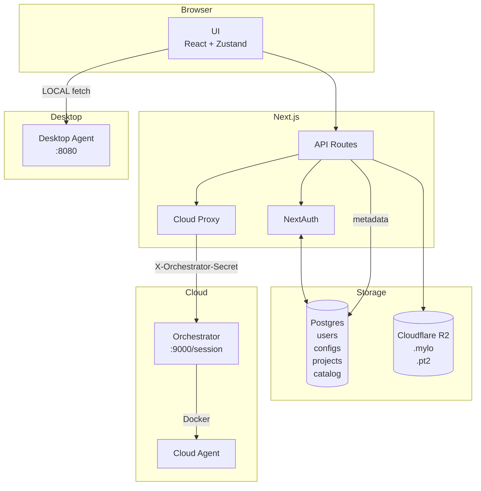

| Componentă | Responsabilitate |
|------------|------------------|
| **Web Interface** | Auth, layout, cloud files, proxy, asistent AI |
| **Orchestrator** | Lifecycle containere agent CLOUD |
| **Desktop / Cloud Agent** | Modele, CSV, optimizare, editare descriptor |

**Stack:** Next.js 16 · React 19 · Zustand · Drizzle/Postgres · NextAuth · Dockview · XYFlow · Gemini (`@google/genai`) · Cloudflare R2

---

## Structura Proiectului

```
WebInterface/webinterface/
├── src/
│   ├── app/                          # App Router
│   │   ├── page.tsx                  # Landing marketing
│   │   ├── auth/page.tsx             # Login OAuth
│   │   ├── home/page.tsx             # Hub: Projects / Clients / Catalog
│   │   ├── dashboard/page.tsx        # IDE: MenuBar + WindowManager
│   │   └── api/
│   │       ├── auth/[...nextauth]/   # NextAuth handlers
│   │       ├── cloud/session/        # Provision / teardown CLOUD
│   │       ├── cloud/proxy/[[...path]]/  # Reverse proxy către agent
│   │       ├── ai/chat/              # Gemini chat (server)
│   │       └── storage/
│   │           ├── projects/[id]/   # Download .mylo privat
│   │           └── catalog/[id]/    # Download catalog partajat
│   ├── components/
│   │   ├── windows/                  # Panouri Dockview
│   │   │   ├── WindowManager.tsx
│   │   │   ├── ModelEditor/
│   │   │   ├── FileExplorer/
│   │   │   ├── DataWindows/
│   │   │   ├── Optimization/
│   │   │   ├── Diagnostics/
│   │   │   └── Other/                # Chat, Properties, Settings
│   │   ├── pages/                    # Tab-uri Home
│   │   ├── structural/               # MenuBar, Dropdown
│   │   └── effects/                  # Hero landing
│   ├── lib/
│   │   ├── client/                   # Client, Tunnel, tipuri endpoint
│   │   ├── cloud/                    # Orchestrator client + session helpers
│   │   ├── store/                    # Zustand: client / project / workspace
│   │   ├── windows/                  # Registry ferestre, Actions, inspect
│   │   ├── ai/                       # Tools, executeTool, prompts
│   │   ├── auth*.ts                  # Login + NextAuth options
│   │   ├── db/                       # Server actions configs/projects/catalog
│   │   └── storage/                  # R2 + server actions
│   ├── db/                           # Drizzle pool, schemas, migrations
│   └── proxy.ts                      # Middleware NextAuth (/home, /dashboard)
└── next.config.ts                    # Limită body server-actions 100mb
```

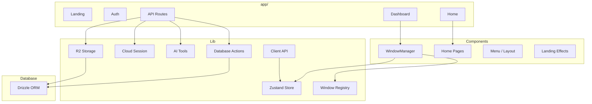

---

## Pagini și Rute

| Rută | Fișier | Auth | Rol |
|------|--------|------|-----|
| `/` | `src/app/page.tsx` | Public | Landing (`HeroSection`) |
| `/auth` | `src/app/auth/page.tsx` | Public | Login GitHub/Google; redirect `/home` dacă e deja logat |
| `/home` | `src/app/home/page.tsx` | Protejat | Hub: select client, proiecte, catalog |
| `/dashboard` | `src/app/dashboard/page.tsx` | Protejat | IDE principal: MenuBar + `WindowManager` |

### Tab-uri `/home`

| Index | Componentă | Rol |
|-------|------------|-----|
| 0 | `ProjectsPage` | Proiecte cloud salvate + deschidere |
| 1 | `ConfigsPage` | Configurații client LOCAL / CLOUD |
| 2 | `CatalogPage` | Catalog partajat (proiecte / .pt2 / .onnx) |

### Bootstrap `/dashboard`

1. Așteaptă rehydratatea Zustand din `sessionStorage`
2. `connect()` cu `ClientConfig` persistat
3. Dacă CLOUD e inaccesibil → `provisionCloudSession({ configId })` o dată, reconnect
4. Opțional `?project=<name>` → `client.NewProject(name)` apoi `getProject()` + hydrate store

---

## API Routes (Next.js)

### GET | POST `/api/auth/[...nextauth]`

NextAuth standard. Providere: **Google**, **GitHub**. Strategie sesiune: **JWT**. Pagină custom: `/auth`. Callback-ul de session injectează `session.user.id = token.sub`.

---

### POST `/api/cloud/session`

**Auth:** obligatoriu (NextAuth).

**Corp cerere:**

```ts
{ name?: string; configId?: string }
```

**Comportament:**
- Cu `configId`: încarcă config CLOUD; `DELETE` sesiune orchestrator veche dacă există; creează una nouă; `updateConfig` cu `address` / `apiKey` / `sessionId` reale
- Fără `configId`: `createOrchestratorSession()` apoi `createConfig(...)`

**Răspuns succes (200):**

```json
{
  "ok": true,
  "config": {
    "name": "...",
    "type": "CLOUD",
    "address": "/api/cloud/proxy",
    "apiKey": "",
    "dbId": "<uuid>",
    "sessionId": "<orch-session>"
  }
}
```

Browserul **nu** primește cheia API reală; proxy-ul o injectează din DB.

**Erori:** `401` Unauthorized · `404` Cloud config not found · `502` Orchestrator/DB (la eșec persist, containerul creat e șters)

---

### DELETE `/api/cloud/session`

**Corp:** `{ configId: string }`

Oprește sesiunea orchestrator; golește `address`, `apiKey`, `sessionId` pe config-ul CLOUD.

**Răspuns:** `{ ok: true }`

---

### ALL `/api/cloud/proxy/[[...path]]`

**Auth:** obligatoriu.  
**Identitate:** header `x-mylo-config-id` (sau `?configId=` pentru SSE / EventSource).

**Flux:**
1. Încarcă config intern (`getConfigInternal`) — `address` + `apiKey` reale
2. Forward către `{address}/{path}` cu `Authorization: Bearer sha256(apiKey)`
3. Streamează body-ul; pasează `content-type`, `content-disposition`, `cache-control`

**Erori:** `401` · `400` missing config id · `404` not CLOUD · `409` not provisioned · `502` upstream failure

---

### POST `/api/ai/chat`

**Auth:** obligatoriu. Necesită `GEMINI_API_KEY`.

**Cerere (`AiChatRequest`):**

```ts
{
  contents: AiContent[];      // turn-uri stil Gemini
  projectContext?: string;    // snapshot din UI
}
```

**Răspuns (`AiChatResponse`):**

```ts
{
  text?: string;
  functionCalls?: { name: string; args: Record<string, unknown>; id?: string }[];
  modelContent?: AiContent;
  error?: string;
}
```

Serverul dezactivează function calling automat; clientul rulează tool-urile într-un loop (max 12 runde).

---

### GET `/api/storage/projects/[id]`

**Auth:** obligatoriu. Doar owner. Streamează bytes `.mylo` din R2.  
Headers: `X-File-Name`, `Content-Disposition: attachment`.

### GET `/api/storage/catalog/[id]`

**Auth:** obligatoriu. Orice user logat poate descărca iteme din catalog.  
Headers: `X-File-Name`, `X-Catalog-Kind` (`project` | `pt2` | `onnx`).

---

### Server Actions (în afara `/api`)

| Modul | Rol |
|-------|-----|
| `src/lib/db/configs.ts` | CRUD configurații client (`'use server'`) |
| `src/lib/storage/cloudProjects.ts` | list / save / delete proiecte user |
| `src/lib/storage/catalog.ts` | list / publish / delete catalog |

---

## Autentificare

1. Utilizatorul deschide `/auth` → `login("github" | "google")` → `signIn(provider, { redirectTo: "/home" })`
2. NextAuth + **DrizzleAdapter** scrie tabelele `user` / `account` / `session` (runtime-ul folosește totuși JWT)
3. `src/proxy.ts` protejează `/home` și `/dashboard`
4. `session.user.id` (= JWT `sub`) scope-uiește toate operațiile DB/R2
5. Sign-out din dropdown-ul de profil de pe `/home`

**Env tipic:** `GOOGLE_ID`, `GOOGLE_CLIENT_SECRET`, `GITHUB_ID`, `GITHUB_SECRET`, `NEXTAUTH_SECRET`, `DATABASE_URL`

---

## Sistem de Ferestre (Window Manager)

### Registry (`src/lib/windows/windowTypes.tsx`)

```ts
enum Windows {
  Visualiser, FileExplorer, ModelEditor, Settings, Chat,
  Properties, DataInfo, DataViewer, Optimization, Diagnostics
}
```

Componentele sunt mapate în obiectul `components` pentru Dockview.

### WindowManager

Folosește **dockview-react**:

1. La ready: restaurează layout din `useWorkspaceStore.getLayout(projectId)` sau default (`FileExplorer` + `Properties` dreapta)
2. Consumă panoul pending din `sessionStorage` (`queuePendingPanel` / `consumePendingPanel`) — folosit când se deschide un model din catalog pe `/home` înainte ca dashboard-ul să monteze
3. Persistă layout la fiecare schimbare: `setLayout(api.toJSON(), projectId)`

### Context de Inspectare

`useInspectablePanel` leagă panourile Visualiser/ModelEditor active de `workspaceStore.panelContexts`, astfel încât **Properties** urmărește selecția via `useActiveInspectContext()`.

### Convenții ID Panou

- `Visualiser-{slotKey}` / `ModelEditor-{slotKey}` / `Optimization-{slotKey}`
- Sloturi: `uploaded_pt2`, `uploaded_onnx`, `optimized_pt2`, `optimized_onnx`

### Roluri Ferestre

| Fereastră | Rol |
|-----------|-----|
| **FileExplorer** | Sloturi proiect, upload, vizualizare, open editor/opt, template-uri |
| **ModelEditor** | Editor graf descriptor (XYFlow) ↔ API-uri edit agent |
| **Visualiser** | Graf read-only (React Flow), alimentează Properties |
| **Properties** | Inspect nod selectat din panoul inspectabil activ |
| **Optimization** | Setup + progres SSE + raport |
| **Diagnostics** | Rulare diagnostics + raport |
| **DataInfo** | Analiză CSV (statistici, corelații, distribuții) |
| **DataViewer** | Tabel date |
| **Chat** | MYLO Assistant (Gemini + tools client-side) |
| **Settings** | Stub |

---

## Client LOCAL vs CLOUD

### Tipuri (`ClientTypes.tsx`)

```ts
enum ClientType { LOCAL = 'LOCAL', CLOUD = 'CLOUD' }

interface ClientConfig {
  type: ClientType;
  name: string;
  address: string;       // LOCAL: http://127.0.0.1:8080
                         // CLOUD (browser): "/api/cloud/proxy"
  apiKey: string;        // CLOUD browser: ""
  dbId?: string;         // id rând DB → header proxy
  sessionId?: string;    // sesiune orchestrator
  cloudEndpoint?: string;
}

const CLOUD_PROXY_BASE = "/api/cloud/proxy";
const CLOUD_CONFIG_HEADER = "x-mylo-config-id";
```

| Mod | Adresă browser | Auth | Init |
|-----|----------------|------|------|
| **LOCAL** | `http://127.0.0.1:8080` | `Bearer sha256(apiKey)` direct | `Client.Initialize()` apelează `/initialize` |
| **CLOUD** | `/api/cloud/proxy` | doar `x-mylo-config-id`; proxy adaugă Bearer | Orchestrator apelează deja `/initialize` — UI **sare** acest pas |

---

## Tunnel și Proxy Cloud

### Tunnel (`Tunnel.ts`)

Metode: `Request` · `timedRequest` · `FileRequest` · `RequestForFile` · `GetRequest`

- **LOCAL auth:** `Authorization: Bearer sha256(apiKey)`
- **CLOUD auth:** doar `x-mylo-config-id: dbId` (proxy adaugă Bearer real)
- **SSE:** `sseUrl` adaugă `?configId=` pentru EventSource (nu poate seta headere custom)

### Orchestrator Client (`orchestrator.ts`)

```ts
ORCHESTRATOR_URL || "http://127.0.0.1:9000"
Header: X-Orchestrator-Secret

createOrchestratorSession()      → POST /session
deleteOrchestratorSession(id)    → DELETE /session/{id}
cleanupOrchestratorOrphans()     → POST /cleanup
```

### Conexiune LOCAL

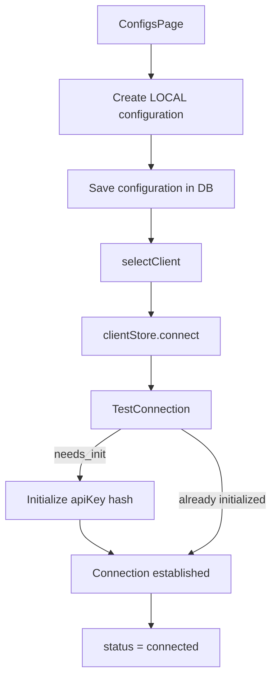

### Conexiune CLOUD

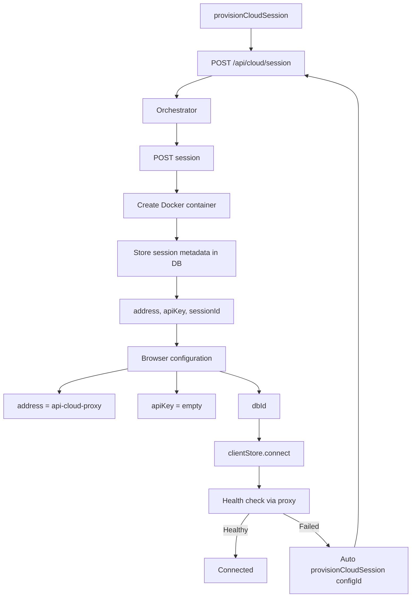

---

## Client HTTP către Agent

`Client.ts` mapează metodele UI pe endpoint-urile Desktop Agent:

| Metodă Client | Path Agent |
|---------------|------------|
| `TestConnection` | `POST /` |
| `Initialize` | `POST /initialize` (doar LOCAL) |
| `OptimizationRequest` | `POST /optimizeModel` |
| `StatusUpdate` | SSE `GET /optimizationStatus` |
| `getOptimizationReport` | `GET /optimizationReport` |
| `ModelDiagnosticsRequest` | `POST /modelDiagnostics` |
| `getModelDiagnosticsReport` | `GET /modelDiagnosticsReport` |
| `LoadModel` / `LoadCSV` | `POST /loadModel` · `/loadCSV` (multipart) |
| Analiză CSV | `/advancedAnalysis`, `/correlationAnalysis`, `/chartData`, `/targetAnalysis` |
| Proiect | `/newProject`, `/getProject`, `/projectFiles`, `/visualizeProjectFile`, `/loadProject`, `/exportProject` |
| Artefacte | `/download-optimized`, `/generateOnnxFromPt2` |
| Editor | `/getModelDescriptor`, `/editModel`, `/previewEdit`, `/saveModelDescriptor`, `/visualizeModel`, `/expandModelNodes`, `/collapseModelNodes`, `/checkEdge`, `/validateModelDescriptor`, `/editor/*` |

---

## State Management (Zustand)

Trei store-uri, persistate parțial în **sessionStorage**:

### `useClientStore` (`mylo-client`)

```ts
{
  config: ClientConfig | null,
  client: Client | null,          // reconstruit la rehydrate
  status: "offline" | "connecting" | "connected"
}
// persistat: doar config
```

### `useProjectStore` (`mylo-project`)

```ts
{
  project,          // { projectData, modelData, csvData, diagnostics*, optimization* }
  csv,
  visualisation,
  optimizationRun: { result, report, updates, runError, completedAt } | null,
  diagnosticsRun:  { result, report, runError, completedAt } | null,
  descriptorDraft,  // NU e persistat — draft live pentru AI
}
```

`hydrateFromProject` normalizează payload-urile plate ale agentului în forma `projectData`.

**Formă proiect normalizată:**

```ts
{
  projectData: {
    name, id, csvFile, modelFile,
    uploadedPt2File, uploadedOnnxFile,
    optimizedPt2File, optimizedOnnxFile
  },
  modelData, csvData,
  hasDiagnosticsReport, diagnosticsReport,
  hasOptimizationReport, optimizationSummary
}
```

### `useWorkspaceStore` (`mylo-workspace`)

```ts
{
  api: DockviewApi | null,          // nu e persistat
  layoutsByProjectId: Record<string, SerializedDockview>,
  inspectablePanelId,
  panelContexts: Record<id, { selected, visualisation }>,
}
```

`resetSessionForHome()` curăță proiectul + chrome la intrarea pe `/home`.  
Cheile legacy (`activeConfig`, `loadedProject`, …) sunt migrate o dată via `migrateLegacySessionStorage()`.

---

## Model Editor

### Calea de Încărcare

1. `getEditorCatalog()` → `GET /editor/catalog` (fallback `POST /getModelEditorCatalog`)
2. `getModelDescriptor()` sau `params.descriptor` din panou
3. `visualizeModel({ descriptor, viewMode, expandedNodes })` → graf React Flow + shapes

### Calea de Editare

```ts
client.editModel({
  descriptor, operation, payload, persist, viewMode, expandedNodes
})
// → POST /editModel
```

Operațiuni folosite în UI: `add_node`, `remove_node`, `update_node`, `add_edge`, `remove_edge`.

| Acțiune UI | Endpoint |
|------------|----------|
| Previzualizare (debounce params) | `POST /previewEdit` |
| Verificare muchie înainte de connect | `POST /checkEdge` |
| Undo / Redo | `POST /editor/undo` · `/editor/redo` |
| Salvare | `POST /saveModelDescriptor` + `publishSavedModelGraph` |
| Validare | `POST /validateModelDescriptor` |

### Catalog Tipuri (`ModelEditor/types.ts`)

```ts
interface Catalog {
  nodeGroups: Record<string, string[]>;
  nodeParameterBlueprints: Record<string, Record<string, CatalogParamBlueprint>>;
  nodePorts: Record<string, CatalogNodePorts>;
  nodeSchemas: Record<string, Record<string, any>>;
  limits?: { maxNodes?: number; maxDepth?: number };
  insertableTypes?: string[];
  swappableActivations?: string[];
}
```

### Sincronizare AI

Descriptorul local e oglindit în `projectStore.descriptorDraft` ca tool-urile AI să vadă editările nesalvate. Tool-urile AI apelează aceleași metode `Client` și emit `mylo:model-edited` (`notifyModelEdited`); ModelEditor ascultă via `onModelEdited` și re-randerează.

### Componente Editor

| Fișier | Rol |
|--------|-----|
| `ModelEditor.tsx` | Wrapper panou |
| `ModelEditorInner.tsx` | Canvas XYFlow + logică edit |
| `PortedNode.tsx` | Nod cu porturi input/output |
| `NodeSettingsPanel.tsx` | Editare parametri nod |
| `ModelContextMenu.tsx` | Meniu contextual (add/remove/…) |
| `helpers.ts` | Transformări graf / utilitare |

---

## Optimizare și Diagnostics

### Optimizare

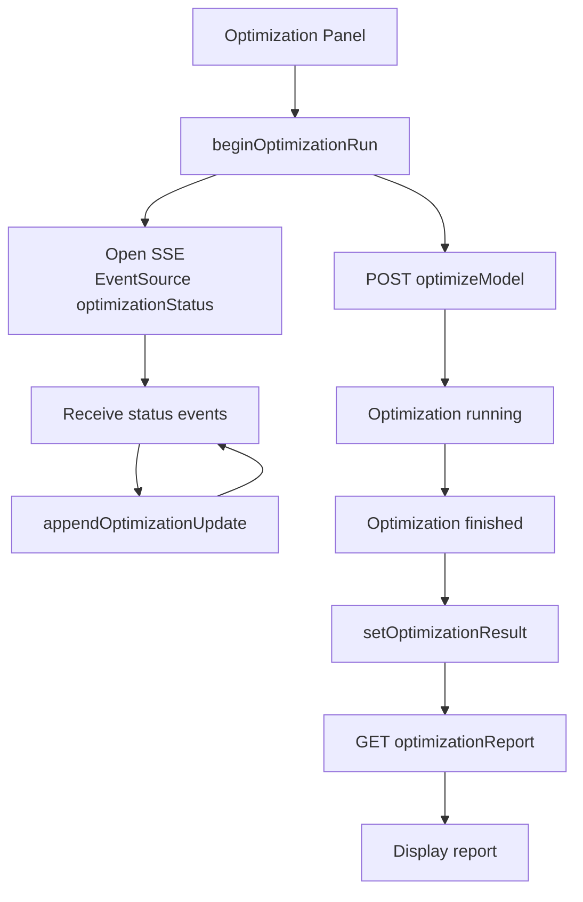

**Evenimente SSE:** `phase`, `status`, `progress`, `complete`, `error`

**State run (`OptimizationRunState`):**

```ts
{
  result: OptimizationReport | null,
  report: OptimizationReport | null,
  updates: ProgressUpdate[],
  runError: string | null,
  completedAt: number | null,
}
```

Raportul include: rezumat strategie, diferențe arhitectură, istoric antrenament, linie de moștenire (neuroevoluție), mutații, verdict improved/regressed.

### Diagnostics

Panoul Diagnostics apelează `POST /modelDiagnostics` și apoi `GET /modelDiagnosticsReport`, stocând rezultatul în `diagnosticsRun`.

---

## Analiză Date

| Acțiune UI | Endpoint Agent |
|------------|----------------|
| Upload CSV | `POST /loadCSV` |
| Analiză avansată | `POST /advancedAnalysis` |
| Matrice corelație | `POST /correlationAnalysis` |
| Date grafice | `POST /chartData` |
| Analiză țintă | `POST /targetAnalysis` `{ targetColumn }` |

**DataInfo** afișează statistici descriptive, corelații, distribuții, calitate date.  
**DataViewer** afișează tabelul (DataTable).  
**Charts** generează vizualizări din `chartData`.

---

## Asistent AI (Chat)

### Loop de Execuție (`Chat.tsx`)

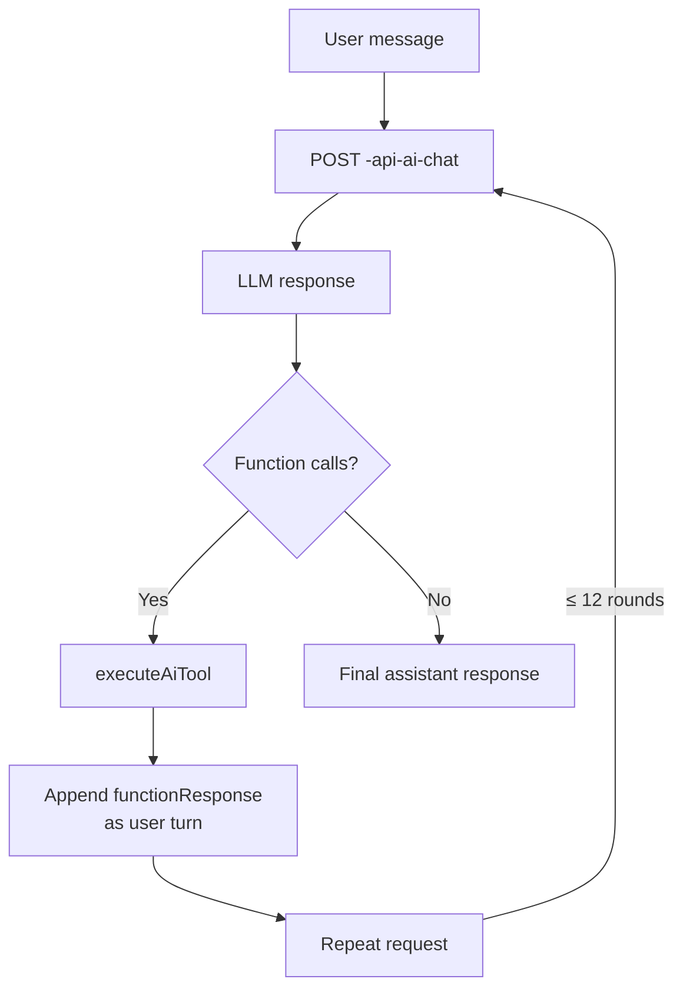

`buildProjectContextSnapshot()` trimite un rezumat al proiectului curent către model.

### Tools Disponibile

| Tool | Efect |
|------|-------|
| `get_project_overview` | Rezumat store (nume, sloturi, status opt) |
| `get_model_descriptor` | Draft sau descriptor agent |
| `get_model_graph_summary` | Noduri/muchii vizualizare |
| `get_csv_summary` | CSV trunchiat |
| `get_editor_catalog` | Catalog tipuri noduri |
| `get_optimization_status` | Run din store |
| `edit_model` / `preview_edit` | API edit + `notifyModelEdited` |
| `validate_model` / `save_model` | Validate/save + publish graf |
| `undo_model_edit` / `redo_model_edit` | Istoric agent |
| `open_dashboard_panel` / `list_open_panels` | Dockview |
| `refresh_project` | `getProject` + hydrate |

System prompt (`systemPrompt.ts`) forțează ordinea: descriptor → catalog → edit (+rewire) → validate → save → răspuns text.

Model implicit: `GEMINI_MODEL` sau `gemini-2.5-flash`.

---

## Storage (Postgres + R2)

### Scheme DB (`userData.ts`)

```ts
clientConfigs   // address, apiKey, type, name, sessionId, userId
cloudProjects   // name, description, cloudSaved, cloudPath
catalogItems    // kind: project|pt2|onnx, fileName, cloudPath
userSettings    // theme, language
```

### R2 (`r2bucket.tsx`)

Client S3 (`R2_BUCKET_ENDPOINT`, keys, `R2_BUCKET_NAME`).  
Metode: `uploadFile` · `getFileBytes` · `deleteFile`.

### Proiecte Cloud Private

- Path: `{userId}/projects/{name}.mylo`
- Tabel: `cloudprojects`
- **Salvare:** agent `exportProjectBlob` → FormData → `saveMyCloudProject` (server action)
- **Deschidere:** `GET /api/storage/projects/:id` → `client.loadProject(file)` → hydrate → `/dashboard`

### Catalog Partajat

- Path: `catalog/{userId}/{itemId}/{file}`
- Tabel: `catalogItems` — `kind: project | pt2 | onnx`
- Listarea e globală (toți userii); ștergerea doar pe itemele proprii
- **Deschidere:** download → `loadProject` sau `LoadModel` + panou pending ModelEditor/Visualiser

> Agentul **nu** vorbește cu R2; doar serverul Next.js are credențiale.

---

## Ciclu de Viață Sesiune Cloud

| Pas | Acțiune |
|-----|---------|
| **Creare** | UI `provisionCloudSession({ name })` → API creează sesiune orch + rând DB |
| **Utilizare** | Browser vorbește doar cu `/api/cloud/proxy` + `dbId` |
| **Restart** | Același API cu `configId` — șterge containerul vechi, provisionează unul nou, update DB |
| **Auto-heal** | Home/Dashboard la eșec connect pe CLOUD |
| **Teardown** | `DELETE /api/cloud/session` sau ștergere config (și teardown) |
| **Anti-orphan** | Dacă scrierea DB eșuează după create orch → șterge sesiunea |

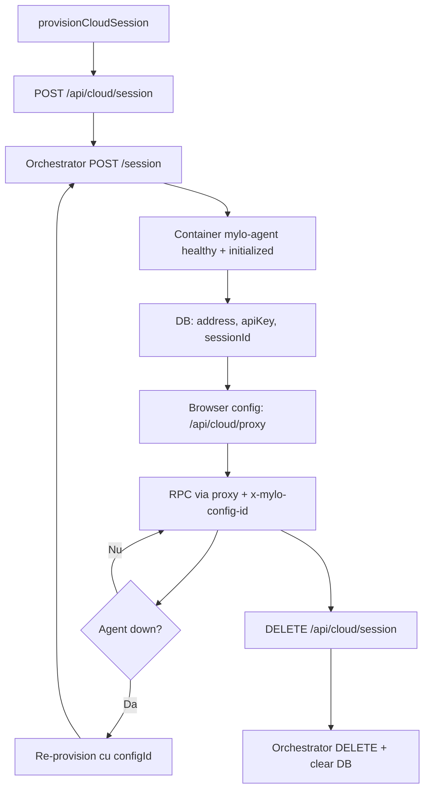

---

## Fluxuri End-to-End

### A. LOCAL: UI → Desktop Agent

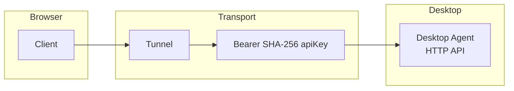

### B. CLOUD: UI → Proxy → Agent

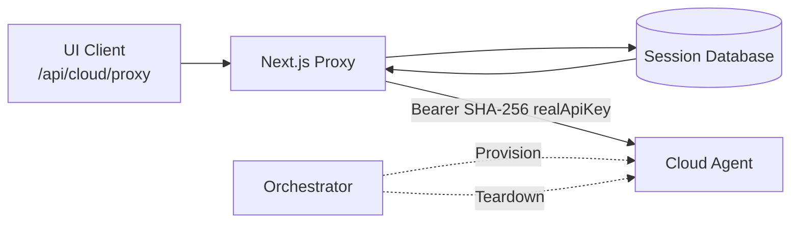

### C. Optimizare

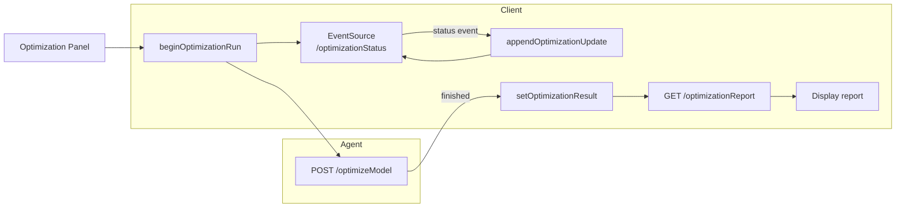

### D. Round-trip proiect cloud

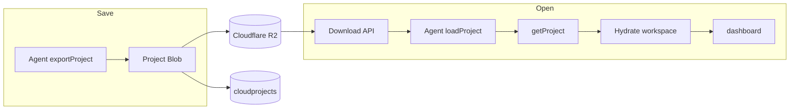

### E. Editare model via AI

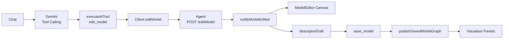

### F. Deschidere din Catalog

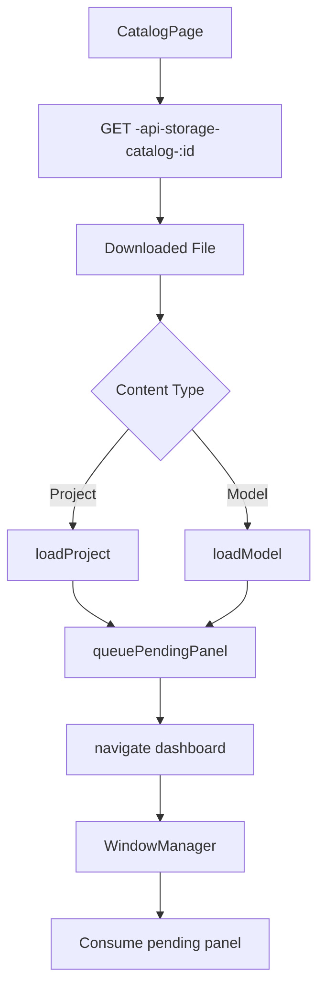

---

## Configurare Web Interface

```env
# Orchestrator
ORCHESTRATOR_URL=http://127.0.0.1:9000
ORCHESTRATOR_SECRET=dev-secret

# Cloudflare R2
R2_BUCKET_ENDPOINT=...
R2_ACCESS_KEY_ID=...
R2_SECRET_ACCESS_KEY=...
R2_BUCKET_NAME=mylo

# Database
DATABASE_URL=...

# AI
GEMINI_API_KEY=...
GEMINI_MODEL=gemini-2.5-flash   # opțional

# NextAuth / OAuth
GOOGLE_ID=...
GOOGLE_CLIENT_SECRET=...
GITHUB_ID=...
GITHUB_SECRET=...
NEXTAUTH_SECRET=...
NEXTAUTH_URL=http://localhost:3000
```

`next.config.ts` crește limita body pentru server-actions la **100mb** (upload-uri `.mylo` mari).

### Pornire Development

```bash
npm run dev
# http://localhost:3000
```

---

## Concluzii

Web Interface-ul MYLO este planul de control al ecosistemului: autentificare, workspace dockable, editor vizual de arhitecturi, analiză date, optimizare cu feedback live, asistent AI cu tool-uri pe agent, și stocare cloud (R2 + Postgres). Separarea clară față de Agent (ML) și Orchestrator (lifecycle containere) permite același UI să lucreze atât cu un Desktop Agent local, cât și cu agenți CLOUD efemeri, fără a expune chei sau adrese reale către browser.

# 

---

# Partea III — Desktop Agent API

# API MYLO

## Cuprins (Agent)

1. [Introducere](#introducere)  
     
2. [Arhitectura Generală](#arhitectura-generală)  
     
3. [API Endpoint-uri](#api-endpoint-uri)  
     
- [Autentificare și Inițializare](#autentificare-și-inițializare)  
    
- [Management Proiecte](#management-proiecte)  
    
- [Model Management](#model-management)  
    
- [Editare Model](#editare-model)  
    
- [Optimizare Model](#optimizare-model)  
    
- [Analiză Date](#analiză-date)  
    
4. [Sisteme ML](#sisteme-ml-complexe)  
     
- [Descriptor Arhitectură](#descriptor-arhitectură)  
    
- [Constructor Dinamic al Modelelor](#constructor-dinamic-al-modelelor-\(descriptormodelbuilder-și-noderegistry\))   
    
- [Motor de Editare Model](#motor-de-editare-model)  
    
- [Motor de Neuroevoluție](#motor-de-neuroevoluție)  
    
- [Optuna Search](#optuna-search)  
    
- [Transfer Greutăți](#transfer-greutăți)  
    
5. [Formate de Date](#formate-de-date)  
     
6. [Concluzii](#concluzii)

---

## Introducere

Acest document prezintă în detaliu API-ul, sistemele ML și arhitectura aplicației MYLO.

---

## Arhitectura Generală

Aplicația este structurată modular, în jurul unor componente **core** care implementează funcționalitățile esențiale ale API-ului. Aceste module gestionează definirea arhitecturii modelelor, validarea acestora, precum și compatibilitatea și execuția lor.

```shell
MYLO-Desktop-Agent/
├── Core/
│   ├── AdaptedModel.py            # Adaptor pentru nepotriviri de formă
│   ├── ArchitectureDescriptor.py  # Descriere grafică a arhitecturii
│   ├── DescriptorModelBuilder.py  # Construcție model din descriptor
│   ├── NodeRegistry.py            # Înregistrare noduri PyTorch
│   ├── ShapeValidator.py          # Validare propagare forme
│   └── WeightCompatibilityEngine.py # Transfer greutăți
├── Processing/
│   ├── Data/                      # Procesare date
│   ├── Models/                    # Management și editare modele
│   └── Optimization/              # Optimizare (neuroevoluție, Optuna)
├── Types/                         # Tipuri de date
└── App.py                         # FastAPI (API principal)
```

---

## API Endpoint-uri

API-ul Mylo este construit ca un strat de interfață peste funcționalitățile interne ale sistemului, expunând operații pentru gestionarea modelelor, execuția acestora și procesele de optimizare. Comunicarea se face prin endpoint-uri organizate logic, fiecare corespunzând unei acțiuni specifice asupra resurselor (modele, date, configurații).

### Autentificare și Inițializare

#### `GET /`

Verifică dacă serverul rulează.

**Răspuns:** `{"message": "MYLO AGENT is running!"}`

#### `POST /`

Verifică starea sesiunii.

**Răspuns:** `{"Status": bool}`

#### `POST /initialize`

Inițializează o nouă sesiune cu o cheie API.

**Corpul cererii:**

```json
{
  "apiKey": "string"
}
```

**Răspuns:** `{"message": "Initialized"}`

#### `POST /disconnect`

Deconectează sesiunea curentă.

**Răspuns:** `{"message": "Disconnected"}`

---

### Management Proiecte

#### `POST /newProject`

Creează un proiect nou.

**Corpul cererii:**

```json
{
  "name": "string",
  "id": "string"
}
```

}

**Răspuns:** Detalii proiect.

#### `POST /getProject`

Obține informații despre proiectul curent.

**Răspuns:** Detalii proiect, fișiere, date model, date CSV, raport optimizare.

#### `POST /exportProject`

Exportă proiectul curent ca fișier `.mylo` (zip).

**Răspuns:** Fișier zip.

#### `POST /loadProject`

Încarcă un proiect din fișierul `.mylo`.

**Parametri:** Fișier `.mylo` ca `multipart/form-data`.

**Răspuns:** `{"message": "Loaded"}`

---

### Model Management

#### `POST /loadModel`

Încarcă un model (`.pt2` sau `.onnx`).

**Parametri:**

- `file`: Fișier model (`.pt2`, `.onnx`)  
    
- `weightsFile` (opțional): Fișier cu greutăți separate

**Răspuns:** Analiză model și grafic vizualizare.

#### `POST /download-optimized`

Descarcă modelul optimizat.

**Corpul cererii:**

```json
{
  "slot": "pt2" | "onnx",
  "fileName": "string"
}
```

}

**Răspuns:** Fișier model.

#### `POST /visualizeProjectFile`

Vizualizează un fișier model din proiect.

**Corpul cererii:**

```json
{
  "fileName": "string"
}
```

}

**Răspuns:** Grafic model.

---

### Editare Model

#### `POST /getModelDescriptor`

Obține descriptorul arhitecturii modelului.

**Răspuns:**

```json
{
  "descriptor": { /* ArchitectureDescriptor */ }
}
```

}

#### `POST /validateModelDescriptor`

Validează un descriptor.

**Corpul cererii:**

```json
{
  "descriptor": { /* ... */ },
  "strict": false
}
```

}

- `strict`: Dacă `true`, nu permite noduri neconectate ("draft").

**Răspuns:** Rezultat validare și forme propagate.

#### `POST /editModel`

Aplică o operațiune de editare asupra descriptorului modelului.

**Corpul cererii (exemplu: adăugare nod ReLU):**

```json
{
  "descriptor": {
    "model_name": "MyModel",
    "input_shape": [-1, 10],
    "output_shape": [-1, 1],
    "nodes": [
      {"id": "linear_1", "type": "Linear", "params": {"in_features": 10, "out_features": 32}}
    ],
    "edges": [
      {"source": "input", "target": "linear_1"},
      {"source": "linear_1", "target": "output"}
    ]
  },
  "operation": "insert_after",
  "payload": {
    "target_node": "linear_1",
    "new_node_type": "ReLU",
    "new_node_id": "relu_1"
  },
  "persist": true,
  "viewMode": "summary",
  "expandedNodes": []
}
```

}

**Răspuns (exemplu):**

```json
{
  "success": true,
  "descriptor": {
    "model_name": "MyModel",
    "input_shape": [-1, 10],
    "output_shape": [-1, 1],
    "nodes": [
      {"id": "linear_1", "type": "Linear", "params": {"in_features": 10, "out_features": 32}},
      {"id": "relu_1", "type": "ReLU", "params": {}}
    ],
    "edges": [
      {"source": "input", "target": "linear_1"},
      {"source": "linear_1", "target": "relu_1"},
      {"source": "relu_1", "target": "output"}
    ]
  },
  "graph": {
    "nodes": [{"id": "input", "type": "input"}, {"id": "linear_1", "type": "Linear"}, {"id": "relu_1", "type": "ReLU"}, {"id": "output", "type": "output"}],
    "edges": [{"source": "input", "target": "linear_1"}, {"source": "linear_1", "target": "relu_1"}, {"source": "relu_1", "target": "output"}]
  },
  "shapes": {"input": [-1, 10], "linear_1": [-1, 32], "relu_1": [-1, 32], "output": [-1, 1]}
}
```

}

**Operațiuni suportate:**

1. `add_node`: Adaugă un nod nou  
     
2. `remove_node`: Șterge un nod  
     
3. `update_node`: Actualizează parametrii unui nod  
     
4. `swap_node_type`: Schimbă tipul unui nod (ex: `ReLU` → `GeLU`)  
     
5. `add_edge`: Adaugă o muchie între două noduri  
     
6. `remove_edge`: Șterge o muchie  
     
7. `insert_after`: Inserează un nod după un altul  
     
8. `scale_width`: Scalează lățimea unui strat (ex: `out_features`/`out_channels`)  
     
9. `add_skip_connection`: Adaugă o conexiune "skip"

#### `POST /previewEdit`

Previzualizează o editare fără a o salva.

**Parametri:** La fel ca `editModel`.

#### `POST /checkEdge`

Verifică dacă o muchie este compatibilă.

**Corpul cererii:**

```json
{
  "descriptor": { /* ... */ },
  "source": "string",
  "target": "string",
  "sourcePort": "output",
  "targetPort": "input"
}
```

}

**Răspuns:** `{"compatible": true/false, ...}`

#### `POST /saveModelDescriptor`

Salvează descriptorul (validare strictă).

**Corpul cererii:** La fel ca `validateModelDescriptor`.

#### `POST /compileModelDescriptor`

Validează descriptorul pentru compilare/export.

**Corpul cererii:** La fel ca `validateModelDescriptor`.

#### `POST /visualizeModel`

Generează graficul de vizualizare.

**Corpul cererii:**

```json
{
  "descriptor": { /* ... */ },
  "viewMode": "summary" | "detailed" | "hybrid",
  "expandedNodes": []
}
```

}

#### `POST /expandModelNodes`

Extinde nodurile în subgrafice ONNX (mod hybrid).

**Corpul cererii:**

```json
{
  "descriptor": { /* ... */ },
  "nodeIds": [],
  "expandedNodes": []
}
```

}

#### `POST /collapseModelNodes`

Comprimă înapoi nodurile extinse.

**Parametri:** La fel ca `expandModelNodes`.

#### `GET /editor/catalog`

Obține catalogul de tipuri de noduri suportate.

**Răspuns:** Tipuri inserabile, activări editabile, tipuri protejate, limite, operațiuni, moduri vizualizare.

#### `GET /editor/templates`

Obține șabloane de modele comune.

**Răspuns:** Lista șabloanelor.

#### `POST /editor/undo`

Anulează ultima editare salvată.

#### `POST /editor/redo`

Reface ultima editare anulată.

---

### Optimizare Model

#### `POST /optimizeModel`

Pornește optimizarea modelului.

**Corpul cererii:**

```json
{
  "modelFilepath": "string",
  "inputFeatures": [],
  "targetFeature": "string" | [],
  "epochs": 10,
  "encoding": "none",
  "strategy": "neuroevolution" | "optuna",
  "generations": 5,
  "problemType": "regression" | "classification"
}
```

}

**Răspuns:** Actualizări status și rezultat optimizare.

#### `GET /optimizationStatus`

Urmărește statusul optimizării (streaming Server-Sent Events).

**Evenimente:**

- `phase`: Schimbare fază (procesare, optimizare, salvare)  
    
- `status`: Mesaj status  
    
- `progress`: Procent progres  
    
- `complete`: Optimizare terminată  
    
- `error`: Eroare

#### `GET /optimizationReport`

Obține raportul complet al optimizării.

**Răspuns:** Rezumat, diferențe arhitectură, istoric antrenament, linie de moștenire, etc.

---

### Analiză Date

#### `POST /loadCSV`

Încarcă un fișier CSV.

**Parametri:** Fișier CSV ca `multipart/form-data`.

**Răspuns:** Analiză CSV.

#### `POST /advancedAnalysis`

Efectuează analiză avansată a datelor.

**Răspuns:**

- Statistici descriptive  
    
- Matrice de corelație  
    
- Analiză distribuții  
    
- Verificare calitate date

#### `POST /correlationAnalysis`

Obține matricea de corelație.

#### `POST /chartData`

Generează date pentru grafice.

#### `POST /targetAnalysis`

Analizează variabila țintă.

**Corpul cererii:**

```json
{
  "targetColumn": "string"
}
```

}

---

## Sisteme ML

### Descriptor Arhitectură (`ArchitectureDescriptor`)

`ArchitectureDescriptor` (în **\[`Core/ArchitectureDescriptor.py`\]** este **inovația centrală** a MYLO: reprezintă arhitectura unei rețele neuronale ca un **graf aciclic direcționat (DAG)** cu noduri tipizate și muchii care definesc fluxul de date.

#### Exemplu de DAG pentru un model Feed-Forward Simplu

**Mermaid Diagram Code**

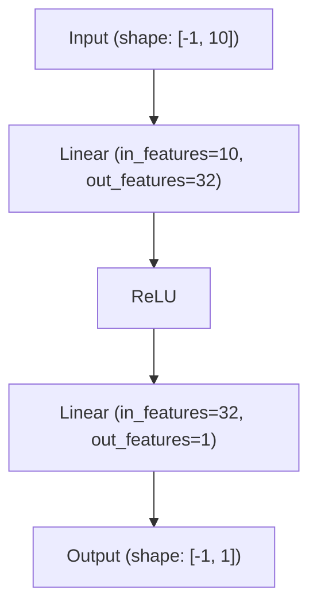

#### Structura Completă a Clasei de Date

```py
@dataclass
class ArchitectureDescriptor:
    model_name: str
    input_shape: List[int] # Ex: [-1, 10] (batch size, features)
    output_shape: List[int] # Ex: [-1, 1]
    nodes: List[Node] # Lista tuturor nodurilor din graf
    edges: List[Edge] # Lista tuturor legăturilor (muchiilor)
    tensor_contracts: Dict[str, TensorContract] = field(default_factory=dict)
    merge_rules: Dict[str, Any] = field(default_factory=dict)
    propagation_rules: str = "deterministic_forward"
```

#### Nod (`Node`)

```py
@dataclass
class Node:
    id: str
    type: str
    params: Dict[str, Any] = field(default_factory=dict)
    io: Dict[str, List[str]] = field(default_factory=dict)
    execution: Dict[str, Any] = field(default_factory=dict)
```

execution: Dict\[str, Any\] \= field(default\_factory=dict)

**Exemplu de nod Linear:**

```py
Node(
    id="linear_1",
    type="Linear",
    params={"in_features": 10, "out_features": 32, "bias": True},
    io={"inputs": ["input"], "outputs": ["output"]}
)
```

)

#### Muchie (`Edge`)

```py
@dataclass
class Edge:
    source: str
    target: str
    source_port: str = "output"
    target_port: str = "input"
```

#### Funcționalități Cheie în Detaliu

##### 1\. Validare Grafică (`validate()`)

Metoda `validate()` execută verificări complete pentru a asigura consistența grafului:

```py
def validate(self) -> None:
    # Pasul 1: Verificare cicluri cu sortare topologică
    node_ids = {node.id for node in self.nodes}
    in_degree = {node_id: 0 for node_id in node_ids}
    adj = {node_id: [] for node_id in node_ids}
    for edge in self.edges:
        if edge.source in node_ids and edge.target in node_ids:
            adj[edge.source].append(edge.target)
            in_degree[edge.target] += 1
    # ... continuare validare topologică ...
```

\# Pasul 2: Verificare accesibilitate din "input"

\# Pasul 3: Verificare existență cale către "output"

\# Pasul 4: Verificare porturi valide

\# Pasul 5: Verificare noduri multi-intrare doar Add/Concat

##### 2\. Propagare Automată a Formelor (`_propagate_shapes(mutate: bool)`)

Aceasta este o caracteristică **unică**: MYLO calculează automat formele tensorilor prin toată arhitectura și, dacă `mutate=True`, actualizează parametrii nodurilor\!

**Exemple de reguli de propagare:**

| Tip Nod | Regulă de Calcul Formă |
| :---- | :---- |
| `Linear` | `output_shape = [batch_size, out_features]` (actualizează și `in_features` după intrare) |
| `Conv1d` | `output_shape = [batch_size, out_channels, floor((in_length + 2*padding - dilation*(kernel_size-1)-1)/stride + 1)]` |
| `MaxPool1d` | Similar cu Conv1d, dar pentru pooling |
| `LSTM` | `output_shape = [batch_size, sequence_length, hidden_size]` |
| `Flatten` | Aplatizează toate dimensiunile în afară de batch |

**Cod snippet pentru propagare formă Linear:**

```py
# Extras din ArchitectureDescriptor._propagate_shapes()
if node.type == "Linear":
    # Preia forma intrării
    input_shape = shape_dict[source_node_id]
    in_features = input_shape[-1]
    out_features = node.params.get("out_features", in_features)
    # Dacă mutate=True, actualizează parametrul in_features al nodului!
    if mutate:
        node.params["in_features"] = in_features
    # Setează forma de ieșire
    shape_dict[node.id] = [*input_shape[:-1], out_features]
```

##### 3\. Normalizare (`normalize_inplace()`)

Aplică `_propagate_shapes(mutate=True)` pentru a actualiza automat toți parametrii descriptorului.

---

### Constructor Dinamic al Modelelor (`DescriptorModelBuilder` și `NodeRegistry`) {#constructor-dinamic-al-modelelor-(descriptormodelbuilder-și-noderegistry)}

#### `NodeRegistry` \[`Core/NodeRegistry.py`\]

Un registru central care mapează tipuri de noduri la module PyTorch și definiții de execuție.

**Exemplu de înregistrare pentru Linear:**

```py
NODE_REGISTRY = {
    "Linear": {
        "module": torch.nn.Linear,
        "param_mapping": {
            "in_features": "in_features",
            "out_features": "out_features",
            "bias": "bias"
        },
        "execution_type": "standard_forward"
    },
    # ... și alte tipuri
}
```

#### `DescriptorModelBuilder` și `DynamicGraphModule`

\[`Core/DescriptorModelBuilder.py`\]

Construiește un model PyTorch funcțional dintr-un `ArchitectureDescriptor`. Clasa cheie este `DynamicGraphModule`:

```py
class DynamicGraphModule(torch.nn.Module):
    def __init__(self, descriptor: ArchitectureDescriptor):
        super().__init__()
        self.descriptor = descriptor
        # Construiește modulele PyTorch pentru fiecare nod
        self.node_modules = torch.nn.ModuleDict()
        for node in descriptor.nodes:
            # Obține clasa modulului din NodeRegistry
            module_cls = NODE_REGISTRY[node.type]["module"]
            # Inițializează modulul cu parametrii din nod
            self.node_modules[node.id] = module_cls(**node.params)
        # Sortează nodurile topologic pentru execuție
        self._sorted_node_ids = self._topological_sort()
```

```py
def forward(self, x: torch.Tensor) -> torch.Tensor:
    tensor_map = {"input": x}
    # Execută nodurile în ordine topologică
    for node_id in self._sorted_node_ids:
        # Colectează intrările din tensor_map folosind muchiile
        inputs = self._collect_node_inputs(node_id, tensor_map)
        # Aplică modulul nodului
        node = next(n for n in self.descriptor.nodes if n.id == node_id)
        if len(inputs) == 1:
            output = self.node_modules[node_id](inputs[0])
        else:
            # Pentru noduri cu multiple intrări (Add/Concat)
            if node.type == "Add":
                output = sum(inputs)
            elif node.type == "Concat":
                dim = node.params.get("dim", -1)
                output = torch.cat(inputs, dim=dim)
        # Salvează rezultatul în tensor_map
        tensor_map[node_id] = output
    # Returnează rezultatul nodului conectat la "output"
    return tensor_map[self._get_output_node_id()]
```

---

### Motor de Editare Model (`ModelEditEngine`)

`ModelEditEngine` **\[`Processing/Models/ModelEditing.py`\]** permite editarea grafică cu suport pentru **noduri draft** (neconectate) și istoric undo/redo.

#### Moduri Validare

1. **Relaxat (strict=False):** Validează numai subgraful activ (conectat la "input"); permite noduri draft  
     
2. **Strict (strict=True):** Validează tot graful; folosit pentru salvare/export

#### Istoric Undo/Redo (`_ProjectHistory`)

```py
class _ProjectHistory:
    MAX_STATES = 50  # Limită la 50 de stări
    def __init__(self):
        self.undo_stack = []
        self.redo_stack = []
    def push_state(self, descriptor: ArchitectureDescriptor):
        self.undo_stack.append(copy.deepcopy(descriptor))
        # Resetează redo stack când se face o nouă editare
        self.redo_stack.clear()
        if len(self.undo_stack) > self.MAX_STATES:
            self.undo_stack.pop(0) # Șterge cea mai veche stare
```

### Motor de Neuroevoluție (`NeuroevolutionEngine`)

`NeuroevolutionEngine` **\[`Processing/Optimization/Neuroevolution.py`\]** optimizează arhitectura folosind algoritmi genetici, cu multiple inovații.

#### Diagrame a Fluxului de Neuroevoluție

**Mermaid Diagram Code**

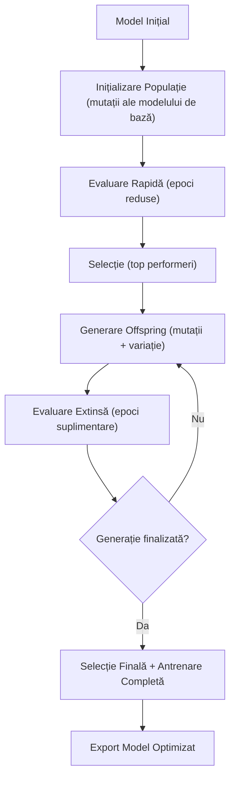

#### `MutationGrammar` – Mutări Valide

Definește mutațiile care nu distrug graful:

1. `scale_width`: Scalează `out_features`/`out_channels`/`hidden_size` cu un factor (0.5, 0.67, 0.8, 1.0, 1.25, 1.5, 2.0, 3.0)  
     
2. `mutate_activation`: Înlocuiește un nod de activare (ex: ReLU → GeLU)  
     
3. `add_layer`: Inserează un strat după un nod existent  
     
4. `remove_layer`: Șterge un strat și reconectează părintele la copil  
     
5. `add_skip_connection`: Adaugă o conexiune skip cu un nod `Concat`  
     
6. `swap_recurrent_type`: Schimbă între LSTM și GRU păstrând dimensiunile  
     
7. `add_norm_layer`: Adaugă BatchNorm/LayerNorm

**Exemplu de mutare `scale_width`:**

```py
# Extras din MutationGrammar.scale_width()
if node.type == "Linear":
    old_out = node.params.get("out_features", 0)
    new_out = max(1, int(old_out * factor)) # Asigură-te că nu ajungem la 0!
    node.params["out_features"] = new_out
    descriptor.normalize_inplace() # Propagă forma!
```

#### `TieredEvaluator` – Evaluare Rapidă

Pentru a economisi timp, evaluarea se face în trepte:

1. **Tier 1 (3 epoci):** Filtrează rapid arhitecturile slabe  
     
2. **Tier 2 (8 epoci):** Antrenează mai mult candidații promițători  
     
3. **Finale (15 epoci):** Antrenează complet câștigătorii

#### Fitness cu Penalizare de Complexitate

```py
def calculate_fitness(val_loss: float, model: torch.nn.Module, lambda_penalty: float = 1e-6) -> float:
    num_params = sum(p.numel() for p in model.parameters() if p.requires_grad)
    complexity_penalty = lambda_penalty * num_params
    # Bonusuri pentru arhitecturi "bune"
    bonus = 0.0
    # Bonus pentru straturi recurente
    if any(n.type in ["LSTM", "GRU"] for n in descriptor.nodes):
        bonus -= 0.005
    # Bonus pentru atenție
    if any(n.type == "MultiheadAttention" for n in descriptor.nodes):
        bonus -= 0.005
    return val_loss + complexity_penalty + bonus
```

bonus \-=  0.005

---

### Optuna Architecture Search (`OptunaSearchEngine`)

`OptunaSearchEngine` **\[`Processing/Optimization/OptunaSearch.py`\]** folosește Optuna pentru o căutare **parametrizată și eficientă** a spațiului de arhitecturi.

#### Spațiul de Căutare Structurat

| Parametru | Domeniu/Opțiuni |
| :---- | :---- |
| `width_multiplier` | 0.25, 0.5, 0.75, 1.0, 1.5, 2.0 |
| `depth_delta` | \-2, \-1, 0, 1, 2 (număr straturi adăugate/șterse) |
| `activation` | "relu", "gelu", "silu", "tanh", "leaky\_relu" |
| `dropout_rate` | 0.0 – 0.5 (step 0.05) |
| `normalization` | "batch", "layer", "none" |
| `use_skip` | True / False |
| `learning_rate` | 1e-4 – 1e-2 (log scale) |
| `optimizer` | "adam", "adamw", "sgd" |

#### `HyperbandPruner` – Oprește Rapid Trial-urile Slabe

Hyperband este un algoritm de alocare a resurselor: alocă puține resurse (epoci) multor trial-uri, apoi alocă mai mult resurse celor care par promițători.

---

### Weight Compatibility Engine (`WeightCompatibilityEngine`)

`WeightCompatibilityEngine` **\[`Core/WeightCompatibilityEngine.py`\]** transferă greutățile din modelul părinte în noile arhitecturi generate – **reducând drastic timpul de antrenament\!**

#### Strategii de Transfer

1. **Potrivire Directă:** Dacă `src_tensor.shape == tgt_tensor.shape`, copiază direct\!  
     
2. **Transfer Parțial:** Dacă dimensiunile sunt compatibile (sursă mai mică):

```py
# Extras din WeightCompatibilityEngine._partial_shape_transfer()
tgt = tgt_tensor.clone()
slices = tuple(slice(0, s) for s in src_tensor.shape)
tgt[slices] = src_tensor
return tgt
```

3. **Rezolvare Chei:** Folosește euristici pentru a potrivi cheile din `state_dict`

---

### Constructor Dinamic al Modelelor

`DescriptorModelBuilder` **\[`Core/DescriptorModelBuilder.py`\]** construiește un model PyTorch dintr-un descriptor.

#### DynamicGraphModule

`DynamicGraphModule` (subclasă `nn.Module`) execută graful:

1. Sortează nodurile topologic  
     
2. Colectează intrările fiecărui nod din muchii  
     
3. Aplică operațiile nodurilor în ordine  
     
4. Returnează rezultatul nodului conectat la "output"

#### NodeRegistry

`NodeRegistry` (în `Core/NodeRegistry.py`) mapează tipurile de noduri la module PyTorch și operații de execuție.

**Tipuri suportate:**

- Straturi: Linear, Conv1d, Conv2d, ConvTranspose1d/2d  
    
- Activări: ReLU, Tanh, Sigmoid, Softmax, LogSoftmax  
    
- Recurente: LSTM, GRU  
    
- Normalizare: BatchNorm1d, BatchNorm2d, LayerNorm  
    
- Pooling: MaxPool1d/2d, AvgPool1d/2d  
    
- Manipulare forme: Flatten, Reshape, Squeeze, Unsqueeze, Transpose, Permute  
    
- Fusion: Add, Concat  
    
- Altele: Dropout, Identity, Embedding, ReduceMean, MultiheadAttention, TransformerEncoderLayer

---

### Motor de Editare al Modelelor

`ModelEditEngine` **\[`Processing/Models/ModelEditing.py`\]** gestionează editările descriptorului cu suport pentru "draft nodes" (noduri neconectate).

#### Moduri Validare

- **Relaxat (implicit):** Permite noduri "draft" (neconectate); validează numai subgraful activ (conectat la "input").  
    
- **Strict:** Toate nodurile trebuie conectate și valide; folosit la salvare.

#### Istoric Undo/Redo

`_ProjectHistory` stivează istoricul pe proiect, cu limită de 50 de stări.

---

### Motor de Neuroevoluție

`NeuroevolutionEngine` \[**`Processing/Optimization/Neuroevolution.py`**\] optimizează arhitectura folosind algoritmi genetici.

#### Funcționare

1. **Populație Inițială:** Se creează `N` mutații aleatorii ale modelului inițial.  
     
2. **Evaluare:** Fiecare candidat este antrenat și evaluat pe setul de validare.  
     
3. **Selecție:** Cei mai buni candidați sunt aleși pentru a genera următoarea generație.  
     
4. **Mutație:** Se aplică mutații aleatorii:  
     
- Adăugare/ștergere strat  
    
- Adăugare/ștergere conexiune skip  
    
- Schimbare funcție de activare  
    
- Schimbare lățime strat  
    
- Schimbare tip recurrent (LSTM ↔ GRU)  
    
5. **Criteriu Oprire:** După un număr fix de generații sau stagnare.

#### Scor Fitness

`scor = val_loss + λ * complexitate`, unde:

- `val_loss`: Pierdere pe validare  
    
- `complexitate`: Număr de parametri (penalizare pentru modele prea mari)

---

### Optuna Search

`OptunaSearchEngine` \[**`Processing/Optimization/OptunaSearch.py`**\] folosește librăria Optuna pentru căutarea hiperparametrică și a arhitecturii.

#### Componentă

- **Sampler:** `TPESampler` (Tree-structured Parzen Estimator)  
    
- **Pruner:** `HyperbandPruner` (oprește trial-urile slabe devreme)  
    
- **Spațiu de Căutare:**  
    
  - Număr straturi  
      
  - Lățime fiecare strat  
      
  - Funcții de activare  
      
  - Dropout rate  
      
  - Tipuri de straturi

---

## Formate de Date

### Format `.pt2`

Fișier PyTorch care conține:

```json
{
  "model_config": ArchitectureDescriptor.to_dict(),
  "state_dict": torch.nn.Module.state_dict()
}
```

### Format `.mylo`

Arhivă ZIP care conține tot proiectul:

- `projectInfo.json`: Metadata proiect  
    
- `modelInfo.json`: Analiză model  
    
- `csvInfo.json`: Analiză CSV  
    
- `descriptor.json`: Descriptor arhitectură  
    
- Fișiere model (.pt2, .onnx)  
    
- Fișier CSV  
    
- `optimization_report.json`: Raport optimizare

---

## Concluzii

API-ul MYLO Desktop Agent oferă un set complet de instrumente pentru design, editare și optimizare automată a modelelor de învățare automată. Sisteme precum descriptorul arhitecturii, motorul de neuroevoluție și transferul de greutăți fac posibilă explorarea eficientă a spațiului arhitecturilor și îmbunătățirea performanțelor modelului.  

---

# Partea IV — Orchestrator

# Orchestrator MYLO

## Cuprins (Orchestrator)

- [Introducere](#introducere)
- [Arhitectura Generală](#arhitectura-generală)
- [Rol în Ecosistemul MYLO](#rol-în-ecosistemul-mylo)
- [API Endpoint-uri](#api-endpoint-uri)
- [Autentificare](#autentificare)
- [Management Sesiuni](#management-sesiuni)
- [SessionStore](#sessionstore)
- [Docker Manager](#docker-manager)
- [Ciclu de Viață al Containerelor](#ciclu-de-viață-al-containerelor)
- [Model de Securitate (Chei API)](#model-de-securitate-chei-api)
- [Configurare și Variabile de Mediu](#configurare-și-variabile-de-mediu)
- [Curățare și Recuperare](#curățare-și-recuperare)
- [Fluxuri de Date](#fluxuri-de-date)
- [Concluzii](#concluzii)

---

## Introducere

Acest document prezintă în detaliu Orchestratorul MYLO: serviciul FastAPI care aprovisionează, urmărește și distruge containere Docker ce rulează **MYLO Desktop Agent** pentru sesiunile CLOUD.

Orchestratorul **nu** rulează workload-uri ML și **nu** proxiează traficul de optimizare/editare. Rolul său este exclusiv de **lifecycle manager** pentru agenți containerizați.

---

## Arhitectura Generală

Serviciul este structurat modular, pe trei fișiere Python:

```
Orchestrator/
├── app.py              # FastAPI — endpoint-uri, auth, lifespan cleanup
├── dockerManager.py    # Creare / ștergere / health / inițializare containere
├── SessionStore.py     # Magazie in-memory pentru sesiuni
├── .env                # ORCHESTRATOR_SECRET (gitignored)
└── README.md
```

| Fișier | Responsabilitate |
|--------|------------------|
| `app.py` | API HTTP, verificare secret, legătura store ↔ Docker |
| `dockerManager.py` | Operații Docker SDK, health-check, init agent |
| `SessionStore.py` | Mapare `sessionId → Session` în memorie |

**Adresă de ascultare:** `127.0.0.1:9000` (doar localhost)

**Stack:** FastAPI · uvicorn · Docker SDK (`docker`) · httpx · python-dotenv

---

## Rol în Ecosistemul MYLO

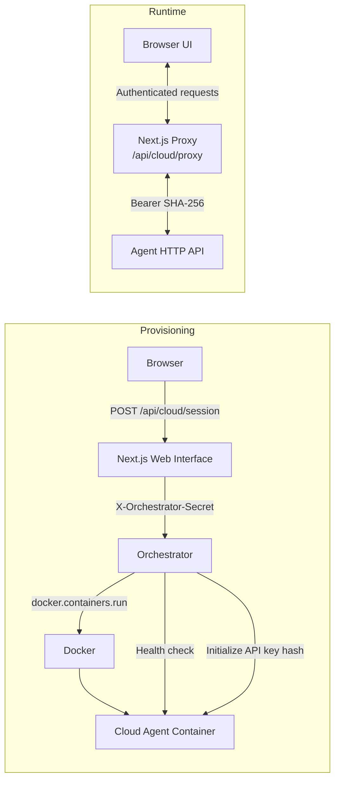

| Componentă | Responsabilitate |
|------------|------------------|
| **Orchestrator** | Lifecycle containere agent + mapă sesiuni in-memory |
| **Web Interface** | Auth utilizator, DB configs, client orchestrator, proxy cloud |
| **Desktop Agent** | API ML (modele, date, optimizare); autentificare prin hash cheie |

**LOCAL vs CLOUD:** agenții LOCAL rulează pe mașina utilizatorului; agenții CLOUD sunt containere create de Orchestrator. Browserul **nu** vorbește niciodată direct cu Orchestratorul — doar prin rutele server Next.js.

---

## API Endpoint-uri

API-ul Orchestratorului expune operații pentru gestionarea sesiunilor CLOUD. Toate endpoint-urile personalizate necesită header-ul `X-Orchestrator-Secret`.

FastAPI expune și `/docs`, `/openapi.json`, `/redoc` (fără secret pe aceste rute implicite).

### Autentificare

Fiecare endpoint verifică secretul:

```python
def requireSecret(secret: str | None):
    if secret != ORCH_SECRET:
        raise HTTPException(status_code=401, detail="Unauthorized")
```

Header HTTP: **`X-Orchestrator-Secret`**  
Valoare: egală cu `ORCHESTRATOR_SECRET` din `.env` (implicit `"dev-secret"`).

---

### POST `/session`

Creează un container agent nou și înregistrează sesiunea.

| | |
|---|---|
| **Auth** | `X-Orchestrator-Secret` |
| **Corp** | niciunul |
| **Succes** | `200` JSON |

**Răspuns:**

```json
{
  "sessionId": "<uuid4>",
  "address": "http://127.0.0.1:<portHostEfemer>",
  "apiKey": "<token url-safe 32 bytes, plaintext>"
}
```

**Comportament:**
1. Verifică secretul
2. `createAgent(dockerClient)` — pornește containerul, așteaptă health, inițializează agentul
3. Construiește `Session(...)` și `store.add(session)`
4. Returnează `sessionId`, `address`, `apiKey` (**nu** returnează `containerId`)

**Erori:** `401` Unauthorized · `500` la eșec Docker/health/init

---

### GET `/session/{sessionId}`

Obține sesiunea și statusul live al containerului.

| | |
|---|---|
| **Path** | `sessionId: str` |
| **Auth** | `X-Orchestrator-Secret` |
| **Succes** | `200` |

**Răspuns:**

```json
{
  "sessionId": "...",
  "address": "http://127.0.0.1:...",
  "apiKey": "...",
  "running": true
}
```

`running` provine din `container_is_running(dockerClient, session.containerId)`.

**Erori:** `401` · `404` `{"detail": "Session not found"}` (doar dacă lipsește din store; containerul Docker poate exista orfan)

> Notă: clientul Web Interface actual **nu** apelează acest endpoint.

---

### DELETE `/session/{sessionId}`

Distruge sesiunea (idempotent).

| | |
|---|---|
| **Path** | `sessionId` |
| **Auth** | `X-Orchestrator-Secret` |
| **Succes** | mereu `200` `{"detail": "Session deleted"}` |

**Comportament:**

```python
session = store.delete(sessionId)
if session:
    deleteAgent(dockerClient, session.containerId)
else:
    deleteAgentBySessionId(dockerClient, sessionId)  # fallback pe nume
```

Chiar dacă store-ul nu are intrare, încearcă ștergerea Docker după numele `mylo-agent-{sessionId[:8]}`. Nu returnează 404.

---

### POST `/cleanup`

Elimină containerele agent orfane (neînregistrate în `SessionStore`).

| | |
|---|---|
| **Auth** | `X-Orchestrator-Secret` |
| **Corp** | niciunul |
| **Succes** | `200` |

**Răspuns:**

```json
{
  "removed": ["mylo-agent-a1b2c3d4", "..."],
  "count": 1
}
```

---

## Management Sesiuni

### SessionStore

`SessionStore` ([SessionStore.py](SessionStore.py)) păstrează sesiunile **doar în memorie**.

#### Structuri de Date

```python
@dataclass
class Session:
    sessionId: str
    containerId: str
    address: str
    apiKey: str

class SessionStore:
    def __init__(self):
        self.sessions: Dict[str, Session] = {}

    def add(self, session: Session): ...
    def get(self, sessionId: str) -> Optional[Session]: ...
    def delete(self, sessionId: str):  # returnează Session | None
```

#### Ciclu de Viață

1. **Creare** — UUID generat în `createAgent`; cheie API plaintext; după init health, sesiunea e stocată sub `sessionId`
2. **Citire** — `GET /session/{id}` doar din memorie
3. **Ștergere** — scoate din dict; stop + remove container Docker
4. **Restart proces** — **toate sesiunile se pierd**; lifespan-ul de startup tratează **toate** containerele agent ca orfane și le șterge (`known_container_ids=set()`)

#### Limitări

- Fără TTL, expirare sau idle cleanup (în afară de startup + `/cleanup`)
- Fără persistență, locking sau siguranță multi-proces
- Singleton global: `store = SessionStore()` în `app.py`
- `containerId` este intern; clienții văd doar `sessionId` / `address` / `apiKey`

---

## Docker Manager

`dockerManager.py` gestionează întreaga interacțiune cu Docker.

### Constante

| Constantă | Valoare | Semnificație |
|-----------|---------|--------------|
| `AGENT_IMAGE` | `"mylo-agent:local"` | Imaginea trebuie construită în prealabil |
| `AGENT_PORT` | `8080` | Portul din container |
| `AGENT_NAME_PREFIX` | `"mylo-agent-"` | Prefix nume |
| `HEALTH_TIMEOUT_SEC` | `60` | Timeout maxim pentru `GET /` |
| `POLL_INTERVAL_SEC` | `0.5` | Interval polling health |

### Naming

```python
def container_name_for_session(session_id: str) -> str:
    return f"{AGENT_NAME_PREFIX}{session_id[:8]}"
# ex: mylo-agent-a1b2c3d4
```

> Coliziune teoretică: doar primele 8 caractere din UUID.

### createAgent(client) — Flux Complet

1. `sessionId = str(uuid.uuid4())`
2. `apiKey = secrets.token_urlsafe(32)` (plaintext)
3. `client.containers.run(...)`:
   - Imagine: `mylo-agent:local`
   - `detach=True`, `remove=False`
   - `name=mylo-agent-{sessionId[:8]}`
   - **Porturi:** `{ "8080/tcp": None }` → Docker alocă **port host aleator**
   - **Labels:** `mylo.role=agent`, `mylo.sessionId=<uuid>`
   - **Env:** `SERVER_IP=0.0.0.0`, `SERVER_PORT=8080`
4. Rezolvă portul host din `NetworkSettings.Ports["8080/tcp"][0]["HostPort"]`
5. `baseUrl = f"http://127.0.0.1:{hostPort}"`
6. `waitHealthy(baseUrl)` — poll `GET {baseUrl}/` până la 200 sau timeout 60s
7. `initializeAgent(baseUrl, apiKey)` — `POST /initialize` cu **SHA-256 hex al apiKey**
8. La orice eșec: stop (5s) + `remove(force=True)`, apoi re-raise
9. Returnează `{ sessionId, containerId, address, apiKey }`

**Rețea:** bridge Docker implicit; publicat pe localhost. Fără network custom, volume, limite de resurse sau restart policy.

### Health Check

```python
def waitHealthy(baseUrl):
    # httpx Client timeout=2.0 per request
    # GET f"{baseUrl}/" până la 200 sau TimeoutError după 60s
```

Agent root: `GET /` → `{"message": "MYLO AGENT is running!"}`.

### Inițializare Agent (Orchestrator → Agent)

```python
def initializeAgent(baseUrl: str, apiKey: str):
    apiKeyHash = hashlib.sha256(apiKey.encode()).hexdigest()
    # POST {baseUrl}/initialize  json={"apiKey": apiKeyHash}
    # așteaptă status 200, altfel RuntimeError
```

Agentul stochează hash-ul ca `CurrentSession.apiKey` și setează `initialized=True`. Cereri ulterioare necesită `Authorization: Bearer <același hash>`.

### Funcții de Ștergere

| Metodă | Semnătură | Comportament |
|--------|-----------|--------------|
| `deleteAgent` | `(client, containerId)` | get by id → stop(10s) → remove(force); ignoră NotFound |
| `deleteAgentBySessionId` | `(client, sessionId) -> bool` | get by name → stop/remove |
| `list_agent_containers` | `(client)` | uniune label `mylo.role=agent` + filtru nume `mylo-agent-` |
| `cleanup_orphaned_agents` | `(client, known_container_ids)` | elimină agenții al căror id nu e în known |
| `container_is_running` | `(client, container_id) -> bool` | status == `"running"`; NotFound → `False` |

### Prerequisit Imagine

Imaginea trebuie construită din `MYLO-Desktop-Agent/`:

```bash
# din MYLO-Desktop-Agent/
docker build -t mylo-agent:local .
```

Dockerfile-ul agentului setează `SERVER_IP=0.0.0.0`, `SERVER_PORT=8080`, `EXPOSE 8080`, `CMD ["python", "App.py"]`.

---

## Ciclu de Viață al Containerelor

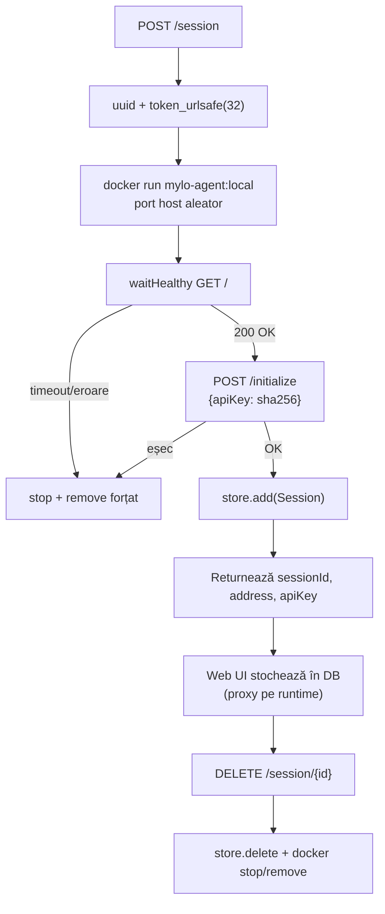

---

## Model de Securitate (Chei API)

### Lanțul de Autentificare

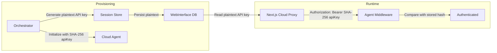

Agentul **nu** vede niciodată cheia plaintext; proxy-ul Web UI re-hash-uiește înainte de forward.

### Model de Încredere

- Orchestratorul are încredere în oricine cunoaște `ORCHESTRATOR_SECRET`
- Web Interface adaugă NextAuth înainte de a apela Orchestratorul
- Browserul nu primește adresa reală a agentului în răspunsurile de provision (folosește `/api/cloud/proxy`); DB-ul ține `address` + `apiKey` server-side
- Legat de `127.0.0.1` — neexpus pe LAN în configurația implicită
- Fără CORS, rate limiting, TLS sau identitate per-user la nivelul Orchestratorului
- Comparație secret prin egalitate de string (fără timing-safe compare)

---

## Configurare și Variabile de Mediu

### Orchestrator (`.env`)

| Variabilă | Implicit | Folosită în |
|-----------|----------|-------------|
| `ORCHESTRATOR_SECRET` | `"dev-secret"` | `app.py` → `ORCH_SECRET` |

Încărcată prin `dotenv.load_dotenv()`.

### Config Hardcodat

| Setare | Valoare |
|--------|---------|
| Host | `127.0.0.1` |
| Port | `9000` |
| Imagine | `mylo-agent:local` |
| Port container agent | `8080` |
| Health timeout | `60s` |
| Health poll | `0.5s` |

### Web Interface (apelant)

| Variabilă | Implicit |
|-----------|----------|
| `ORCHESTRATOR_URL` | `http://127.0.0.1:9000` |
| `ORCHESTRATOR_SECRET` | trebuie să coincidă cu Orchestratorul |

### Env Container Agent (setat de Orchestrator)

| Variabilă | Valoare |
|-----------|---------|
| `SERVER_IP` | `0.0.0.0` |
| `SERVER_PORT` | `8080` |

### Pornire

```bash
python app.py
# uvicorn pe 127.0.0.1:9000, log_level=debug
```

---

## Curățare și Recuperare

| Moment | Acțiune |
|--------|---------|
| **Startup lifespan** | `cleanup_orphaned_agents(..., known=set())` — șterge **toate** containerele agent (store-ul e gol) |
| **POST `/cleanup`** | Șterge agenții care nu sunt în store-ul curent |
| **createAgent eșuat** | Teardown imediat al containerului |
| **Persist DB eșuat (Web)** | Web UI șterge sesiunea orchestrator creată (anti-orphan) |
| **Re-provision (Web)** | Șterge `sessionId` vechi înainte de a crea unul nou |

Logging: loggere `"orchestrator"` și `"orchestrator.docker"` la nivel INFO; uvicorn debug când rulează ca `__main__`.

---

## Fluxuri de Date

### A. Creare sesiune CLOUD

```mermaid
flowchart LR

    USER[User]

    NEXT[Next.js API<br/>POST /api/cloud/session]

    DECISION{Existing session?}

    DELETE[Delete old session]

    subgraph Orchestrator
        CREATE[createOrchestratorSession]
        SESSION[POST /session]
        AGENT[createAgent]
        DOCKER[Docker run]
        HEALTH[Health check]
        INIT[Initialize]
        RESULT[sessionId<br/>address<br/>apiKey]
    end

    DB[(Configs Table)]

    BROWSER[Browser<br/>address = /api/cloud/proxy]

    USER --> NEXT
    NEXT --> DECISION

    DECISION -->|Yes| DELETE --> CREATE
    DECISION -->|No| CREATE

    CREATE --> SESSION
    SESSION --> AGENT
    AGENT --> DOCKER
    DOCKER --> HEALTH
    HEALTH --> INIT
    INIT --> RESULT

    RESULT --> DB
    DB --> BROWSER
```

### B. Teardown

```mermaid
flowchart LR

    USER[User]

    NEXT[Next.js API<br/>DELETE /api/cloud/session]

    DB[(Configs Table)]

    ORCH[Orchestrator]

    STORE[Session Store]

    DOCKER[Docker]

    USER --> NEXT
    NEXT --> DB
    DB -->|sessionId| ORCH

    ORCH -->|DELETE session id| STORE
    ORCH --> DOCKER

    DOCKER -->|Stop & remove container| STORE

    STORE --> NEXT
    NEXT -->|Clear address, apiKey, sessionId| DB
```

### C. Trafic runtime (Orchestratorul NU e pe cale)

```mermaid
flowchart LR

    Browser --> Proxy
    Proxy --> DB[(Configs)]
    DB --> Proxy
    Proxy -->|Bearer SHA-256 apiKey| Agent
    Agent -->|Validate hash| Response
    Response --> Browser
```

---

## Cheat Sheet API

| Metodă | Path | Header | Corp | Răspuns |
|--------|------|--------|------|---------|
| POST | `/session` | `X-Orchestrator-Secret` | — | `{ sessionId, address, apiKey }` |
| GET | `/session/{sessionId}` | același | — | `{ sessionId, address, apiKey, running }` |
| DELETE | `/session/{sessionId}` | același | — | `{ detail: "Session deleted" }` |
| POST | `/cleanup` | același | — | `{ removed: string[], count: number }` |

**401:** `{"detail":"Unauthorized"}`  
**404 (doar GET):** `{"detail":"Session not found"}`

---

## Concluzii

Orchestratorul MYLO este un provisioner minimal dar critic pentru sesiunile CLOUD: creează agenți Docker izolați, îi autentifică cu chei hash-uite, îi urmărește în memorie și îi curăță agresiv la restart sau la cerere. Separarea clară față de traficul ML (gestionat de Web Interface proxy + Agent) ține suprafața de atac mică și responsabilitățile distincte.

